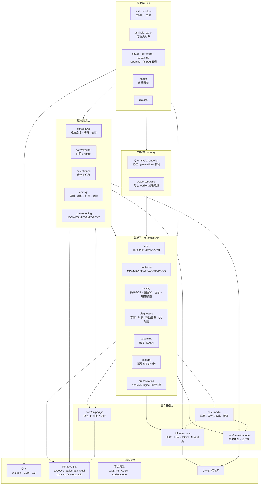

# VideoEye 2.0 - 现代化视频流分析软件

[](LICENSE)
[](https://isocpp.org/)
[](https://www.qt.io/)
[](https://ffmpeg.org/)
[]()

## 项目简介

VideoEye 是一款开源的视频流分析软件，支持 HTTP、RTMP、RTSP 网络流及本地文件输入，提供实时码流分析、帧级信息、容器结构解析与图形化展示。采用 C++17 + Qt6 技术栈，深色专业风格 UI，跨平台支持 Windows / Linux / macOS。

## 主要特性

- **多源输入**: HTTP / RTMP / RTSP 网络流及本地文件
- **流分析**: 实时统计 FPS、码率、关键帧并可视化曲线
- **视频帧分析**: 单独标签页展示 I/P/B 帧类型、序号、PTS、时间戳
- **容器结构分析**: 统一调度解析 MP4/MOV、MKV/WebM、AVI、FLV、MPEG-TS、ASF/WMV、OGG
- **媒体信息**: 基于 FFmpeg `libavformat` 展示完整元数据（容器 / 视频 / 音频 / 字幕 / 章节）
- **硬件加速**: VAAPI/CUDA/D3D11VA/QSV 等硬件解码（解码后统一转 CPU 图像渲染）
- **音频可视化**: 波形快照、FFT 频谱、纯音频律动
- **场景切换检测**: 灰度直方图 Bhattacharyya 距离实时检测镜头切换
- **画面质量（视觉缺陷）**: 黑场 / 冻结 / 花屏马赛克 / 模糊 / 闪烁 / 过曝欠曝 / 色偏 / 隔行梳齿 / 黑边，带证据缩略图与缺陷列表
- **字幕 / 时码 / 辅助数据**: 字幕 cue（SRT / ASS-SSA / WebVTT / tx3g / CEA-608）重叠与空字幕检查、SMPTE 时码与章节、data 流与 SCTE-35 广告插入点
- **质量评估**: 离线逐帧计算 PSNR / SSIM 及走势图
- **报告与批量 QC**: 5 套规则模板 → 单文件/目录批量分析 → 评分与结论 → JSON/CSV/HTML/PDF/TXT 导出
- **FFmpeg 命令工作台**: 直接调用原生 `ffmpeg` 程序 —— 写命令、看实时日志、查参数含义（内置指令字典与逐项解释）
- **帧导出**: 导出任意帧为 JPG / RGB / YUV，支持打开 .yuv / .rgb 原始图像

## 技术栈

| 组件 | 技术 |
|------|------|
| GUI | Qt 6（只用 QtWidgets） |
| 多媒体 | FFmpeg 8.x（Windows 用锁版本预编译包，Linux/macOS 用系统包） |
| 图表 | 自绘 `MetricChartWidget`（QPainter） |
| 音频输出 | 平台原生（WASAPI / ALSA / AudioQueue） |
| MP4 解析 | 自研 `utils::IsobmffParser` |
| 构建 | CMake 3.23+ / Ninja + CMakePresets |

**依赖只有两个硬依赖：Qt Widgets + FFmpeg。** 其余能力（媒体信息展示、图表、MP4 样本表解析、音频输出）全部自研或走平台原生 API，不再集成 MediaInfoLib / Bento4 / SDL2 / QtCharts / Vulkan。

| 平台 | FFmpeg 来源 |
|------|------------|
| Windows | `third_party/prebuilt/windows-x64/ffmpeg/`，缺则由 `scripts/fetch-ffmpeg.ps1` 下载（版本 + URL + SHA256 锁在 `cmake/ffmpeg-version.json`） |
| Linux / macOS | `pkg-config` 找系统开发包（`libavcodec-dev` / `brew install ffmpeg`），找不到才回退预编译包 |

> **许可证**: 随包分发的 FFmpeg 二进制（`av*.dll` / `libav*.so`）按其自身许可证履约（当前锁定的预编译包为 GPLv3）；`ffmpeg` 命令行程序默认不随包分发，由页面引导用户自行安装。VideoEye 自身源码为 MIT。

## 项目架构

VideoEye 采用严格分层架构：`domain` 不反向依赖任何层，`analysis` 不碰 Qt Widgets，`media` 不依赖 FFmpeg，`ffmpeg_io` 作为叶子模块为分析 / 播放 / 导出共用。每层在 CMake 中对应一个真实 target，依赖方向由 `target_link_libraries` 与 `scripts/check_layering.py` 强制校验。



**四条分层硬规则：**

1. **`core/domain`（结果类型）不反向依赖任何人** —— 它不认识分析器、不认识 FFmpeg，保证结果类型可被报告 / 导出 / UI 随意复用。
2. **`core/analysis` 不依赖 Qt Widgets** —— 执行逻辑在纯回调的 `AnalysisEngine`（可离线 / 批处理 / 单测运行），`core/qt` 只负责线程、generation 与信号。
3. **`core/media` 不依赖 FFmpeg**（video 解码层除外）—— MP4 与 extradata 均为自研解析，可被纯 stdlib 单元测试直接覆盖。
4. **`core/ffmpeg_io` 是叶子模块** —— 统一 `avformat_open_input` / `av_read_frame` 的中断与超时，让取消能即时生效，不 include 任何 `core/` 层。

## 项目结构

```
VideoEye/
├── core/
│   ├── domain/model/     # 结果类型与值对象（不依赖分析器、不依赖 FFmpeg）
│   ├── media/            # 容器解析 (container) / 码流参数集 (codec) / 文件探测 (probe) / 清单文本 (streaming)
│   ├── ffmpeg_io/        # 阻塞 IO 的中断与超时（叶子模块，分析/播放/导出共用）
│   ├── analysis/         # 分析器与执行引擎
│   │   ├── codec/        #   H.264 / HEVC / AV1 / VVC 参数集
│   │   ├── container/    #   MP4 / MOV / MKV / FLV / TS / ASF / AVI / OGG 结构
│   │   ├── quality/      #   码率与 GOP、音频 QC、画质指标、视觉缺陷
│   │   ├── diagnostics/  #   字幕 / 时码 / 辅助数据 / QC 规则引擎
│   │   ├── streaming/    #   HLS / DASH 清单与分片
│   │   ├── stream/       #   播放态实时流分析
│   │   └── orchestration/#   全文件分析的执行引擎
│   ├── player/           # 播放会话 (PlaybackSession / 解码器 / 音频输出 / 抽帧)
│   ├── exporter/         # 转码 / remux 导出
│   ├── qc/               # QC 模板、规则映射、批量扫描与对比
│   ├── reporting/        # 报告导出 (JSON / CSV / HTML / PDF / TXT)
│   ├── ffmpeg/           # 命令工作台 (命令解析 / 进程执行 / 指令字典 / 解释器)
│   └── qt/               # 把不带 Qt 的执行引擎接进信号与线程
├── infrastructure/       # 配置 / JSON 序列化 / 日志 / 后台任务调度
├── ui/                   # UI 层 (主题 / 主窗口 / 各分析页 / 自绘图表)
├── third_party/prebuilt/ # FFmpeg 预编译包（不入库，脚本下载）
├── vcpkg.json            # vcpkg 依赖清单
└── build.bat / build.sh  # 构建脚本
```

## 构建

### Windows (Ninja + MSVC)

> **前置要求**：Visual Studio 2022（带 C++/CMake/Ninja） + vcpkg（设置环境变量 `VCPKG_ROOT`）

```powershell
# 一键构建（自动加载 MSVC 环境 + 自动下载 FFmpeg 预编译库 + 自动安装 vcpkg 依赖）
.\build.bat           # Release 构建
.\build.bat debug     # Debug 构建
.\build.bat test      # Release 构建 + 跑单元测试
```

产物：`build\release\bin\VideoEye.exe` / `build\debug\bin\VideoEye.exe`

> 首次构建较慢（vcpkg 编译 qtbase 需 30~60 分钟），之后增量构建秒级完成。

### Linux / macOS

```bash
# Ubuntu/Debian 系统依赖（FFmpeg 用系统开发包，由 pkg-config 查找）
sudo apt install -y build-essential cmake ninja-build pkg-config qt6-base-dev \
  libavcodec-dev libavformat-dev libavutil-dev libswscale-dev libswresample-dev

# macOS
brew install cmake ninja qt@6 ffmpeg

# 构建
./build.sh             # Release
./build.sh debug       # Debug
```

产物：`build/release/bin/VideoEye` / `build/debug/bin/VideoEye`

构建配置的唯一来源是 `CMakePresets.json`；动态库部署由 CMake 完成（Windows 与 exe 同目录，Linux/macOS 进相邻 `lib/` 并写入 RPATH），构建后校验到位。

## 使用指南

1. **打开**: `Ctrl+O` 打开文件 / `Ctrl+U` 打开 URL
2. **播放控制**: 底部控制栏播放/暂停/停止 (`Space` / `Esc`)
3. **分析**: 左侧边栏切换分析模块（媒体信息、流分析、视频帧、音频帧、数据包、异常事件、同步分析、时间轴、音频响度、直方图、容器结构、场景切换、画面质量、质量评估、报告与批量 QC），各模块顶部配有独立「启用分析」开关
4. **FFmpeg 命令工作台**: 侧边栏「FFmpeg 命令」—— 写一条 ffmpeg 命令并运行，右侧字典可以查参数含义
5. **导出帧**: `文件` → `导出视频帧...`（jpg / rgb / yuv）
6. **原始图像**: 打开 `.yuv`（YUV420P）/ `.rgb`（RGB24）时输入宽高

**批量 QC 与报告**：单文件分析、目录批量扫描、双文件对比与报告导出都在 GUI 的「报告与批量 QC」页完成 —— 选模板 → 分析 → 看结论 → 导出（JSON / CSV / HTML / PDF / TXT）。模板接受内置 id（`general` / `broadcast` / `hls-vod` / `short-video` / `archive-master`）或自定义 JSON 文件。

## 测试

用带测试的 preset（`BUILD_TESTING=ON`；Windows 上另带 `VCPKG_MANIFEST_FEATURES=tests` 让 vcpkg 装 gtest）：

```bash
# Windows：推荐 win-test-release（Debug 需要重编整套 debug triplet 的 Qt，约 1 小时）
cmake --preset win-test-release
cmake --build --preset win-test-release
ctest --preset win-test-release

# Linux / macOS
cmake --preset linux-test-debug
cmake --build --preset linux-test-debug
ctest --preset linux-test-debug
```

内存 / 数据竞争体检（Linux 专用，只跑单测、不产出发布物）：

```bash
# ASan + UBSan：堆破坏 / 越界 / 未初始化读
cmake --preset linux-test-asan && cmake --build --preset linux-test-asan
ctest --preset linux-test-asan -j 1 --output-on-failure

# ThreadSanitizer：数据竞争
cmake --preset linux-test-tsan && cmake --build --preset linux-test-tsan
ctest --preset linux-test-tsan -j 1 --output-on-failure
```

TSan 会报 Qt6 自身的数据竞争（Qt 不是 TSan-clean 的库），真红的时候先看报头落在不在
我们自己的 `.cpp` 上；`TSAN_OPTIONS` 可挂 suppression 文件。漏检检测在 preset 里
已关（`ASAN_OPTIONS=detect_leaks=0`）—— Qt / FFmpeg 在退出阶段必然报一堆假阳性。

覆盖码流解析、MP4 样本表、ISOBMFF、QC 规则、码率/GOP、色彩 HDR、导出器等纯逻辑路径。

规模（用 `python scripts/summarize_tests.py` 现算，别手改）：

| 指标 | 数量 |
|---|---|
| 测试可执行文件 | 71 |
| ctest 用例组（gtest 可执行文件） | 71 |
| python 脚本用例组（架构规则门 + 语料校验，非 gtest） | 11 |
| gtest 用例（含 `TEST` / `TEST_F` / `TEST_P`） | 638 |

`ctest -N` 会显示 **82 = 71 + 11**，多出来的 11 个不是 gtest 可执行文件，而是直接
`add_test` 调 python 脚本的 5 道架构规则门及其自测：`check_layering.py` 与它的自测、
`audit_qt_analysis_border.py` 与它的自测、`audit_namespace_layout.py` 与它的自测、
`audit_qt_domain_border.py` 与它的自测、`audit_link_visibility.py` 与它的自测（最后一
道 2026-10-07 从「只有 CI 跑」补进 ctest），加上 `generate_corpus.py --check`（阶段 3.1
的异常语料与生成脚本一致性校验）。它们的「测试」是退出码 + 输出断言，
没有 gtest 用例，所以脚本不计入 gtest 那两个数。

这个数字以前是「18 个可执行文件 + 17 组 ctest」，长期没跟着测试用例涨 —— 所以改成脚本
现算。CI 的 layering job 会跑 `python scripts/summarize_tests.py --expect 71`：加了测试
就一并更新这里和 CI 里的数字，否则那道门直接红，别让表格再飘。

跑之前注意：架构规则那 10 条脚本用例用「`VIDEOEYE_ROOT` 或当前目录」当仓库根，所以 CMake 里给它们
钉了 `WORKING_DIRECTORY ${CMAKE_SOURCE_DIR}`。不加的话 ctest 的工作目录是
`build/test-release/tests`，`os.walk` 会扫到一个不存在的 `core/`，于是「一个依赖都没查到」
被当成「没有跨层反向依赖」放行 —— 那是一道假绿。改了分层/边界规则脚本后，先跑一次
`ctest -R LayeringRulesTests` 确认它真的在扫仓库。

阶段 3.3 起还有四个 libFuzzer 入口（`tests/fuzz/`）：码流参数集 + extradata、容器结构
（MP4 / EBML / FLV / ASF）、HLS / DASH 清单、字幕 + SCTE-35。它们只在 **Linux + clang**
下构建（Windows 上打开开关会在配置期直接报错，这是 libFuzzer 运行时的平台限制）：
`cmake -DVIDEOEYE_ENABLE_FUZZERS=ON` 会把整个构建树带上 ASan/UBSan 插桩（`fuzzer-no-link`），
四个入口各自链 fuzzer 运行时与 main。跑法示例：
`./build/<preset>/bin/FuzzSubtitleAux -max_len=65536 tests/corpus/` —— 入口内的输入硬闸
是 1 MiB，语料目录可以直接喂 `tests/corpus/` 里的确定性样本当种子。

## 文档

完整索引见 [`docs/README.md`](docs/README.md)。

- **改代码前先看** [`docs/ARCHITECTURE.md`](docs/ARCHITECTURE.md) —— 9 层分层、依赖方向与
  强制手段、Qt/domain 边界，以及「加一个分析维度要动哪些文件」的实证清单。
- **各分析维度**的设计说明（码流 / MP4 样本表 / 码率 GOP / 色彩 HDR / 音频 QC /
  画面缺陷 / 字幕时码 / HLS-DASH）在 `docs/` 下按主题各有一篇。
- **横切能力**：`docs/DIAGNOSTICS_QC.md`（规则引擎）、`docs/REPORTING_BATCH_QC.md`（批量与导出）。
- **历史审计快照**在 `docs/audit/`，是某一时刻的记录，不随代码演进。

## 开源协议

VideoEye 自身源码采用 [MIT](LICENSE) 协议。随分发物附带的 FFmpeg 二进制按其自身许可证履约，`ffmpeg` 命令行程序默认不随包分发。

## 致谢

- 原项目作者: [雷霄骅 Lei Xiaohua](https://github.com/leixiaohua1020)
- [FFmpeg](https://ffmpeg.org/) · [Qt](https://www.qt.io/) · [vcpkg](https://github.com/microsoft/vcpkg)
