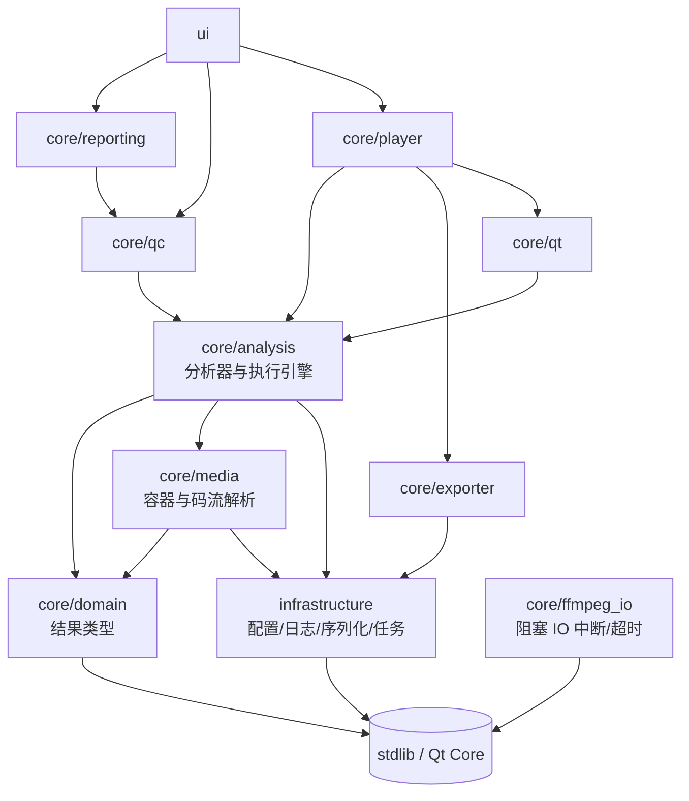

# 分层架构与依赖边界

本文说明 VideoEye 为什么按现在这套目录划分、各层之间允许怎么依赖，以及新增代码该放哪。

## 1. 一句话背景

项目早期只有一个 `utils/` 加一个 `core/`，两者各自包罗万象。结果是：想复用一份 MP4 解析，
要把日志 / 配置 / 报告导出一起拖进编译图；想让命令行跑一次分析，得先起一个 Qt 对象接信号。

现在的划分把"放得到处都是"的东西按**变更原因**归了堆，并且让每个堆在 CMake 里是一个真实的
targe —— 目录只是命名习惯，编译器不认识；能被机器检查的只有 `target_link_libraries` 那条边。

## 2. 目录与目标

| 目录 | CMake target | 职责 | 允许依赖 |
|------|--------------|------|----------|
| `core/domain/model/` | `VideoEyeDomain` | 纯结果类型与值对象 | standard library、Qt Core（历史包袱，见 §5） |
| `infrastructure/config`<br>`infrastructure/serialization`<br>`infrastructure/logging`<br>`infrastructure/concurrency` | `VideoEyeInfrastructure` | 配置、JSON、日志、后台任务调度 | standard library |
| `core/ffmpeg_io/` | `VideoEyeFfmpegIo` | FFmpeg 阻塞 IO 的中断与超时（**叶子模块**，分析/播放/导出共用） | FFmpeg |
| `core/media/codec`<br>`core/media/container`<br>`core/media/probe`<br>`core/media/streaming` | `VideoEyeMedia` | 容器字节级解析、码流参数集解析、文件探测 | domain、infrastructure |
| `core/analysis/stream`<br>`core/analysis/orchestration`<br>`core/analysis/codec`<br>`core/analysis/container`<br>`core/analysis/quality`<br>`core/analysis/diagnostics` | `VideoEyeAnalysis` | 各分析器、执行引擎与编排 | domain、media、infrastructure、ffmpeg_io、FFmpeg |
| `core/exporter/` | `VideoEyeExporter` | 转码 / remux 导出 | domain、infrastructure、ffmpeg_io、FFmpeg |
| `core/player/` | `VideoEyePlayback` | 播放会话、解码、抽帧 | domain、analysis、exporter、infrastructure、ffmpeg_io、qt、FFmpeg |
| `core/qc/` | `VideoEyeQc` | 规则表、模板映射、批处理、对比 | domain、analysis、infrastructure |
| `core/reporting/` | `VideoEyeReporting` | 报告导出（JSON / CSV / HTML / PDF / TXT） | domain、qc、infrastructure |
| `core/ffmpeg/` | `VideoEyeFfmpegTools` | 原生 ffmpeg 命令行工作台 | infrastructure、Qt Core |
| `core/qt/` | `VideoEyeQtAdapters` | 把不带 Qt 的执行引擎接进信号 / 线程；`QtWorkerOwner` 是所有自带 `QThread` 的后台 worker 的统一所有者 | domain、analysis、Qt Core |
| `ui/` | （主程序） | 界面 | 以上全部 + Qt Widgets |

迁移期那个把十层全部 PUBLIC 出去的 `VideoEyeCore` INTERFACE 聚合层**已经删除** ——
它让每个调用方都能编译，代价是依赖关系重新变得不可见（正是因为它，`Playback → Exporter`
这条边一直没暴露）。现在主程序和每个测试都显式链自己需要的那几层。

FFmpeg 与 Qt6::Core/Gui 在 `analysis` / `playback` / `exporter` 上是 **PUBLIC** 而不是 PRIVATE：
这几层的公共头文件里有真正的 `libav*` 与 `QImage`，而静态库的 PRIVATE 依赖只传 link、不传
include 目录 —— 挂 PRIVATE 会让下游"能编译符号、找不到头文件"。

## 3. 依赖方向

箭头指向被依赖的一方，反向一律不允许：



三条硬规则：

1. **`domain` 不反向依赖任何人**。它不知道分析器、不知道 FFmpeg，也不吸 `core/analysis/*`。
   过去 `QcReport.h` 为了拿 `ColorHdrAnalysis` 去 include `ColorHdrAnalyzer.h`，等于让
   "报告""导出""UI"全都间接吃下一个分析器 —— 现在结果类型住在
   `core/domain/model/ColorHdrResult.h`，分析器也只是它的生产者之一。
2. **`analysis` 不依赖 Qt Widgets**。编排层（老名字 `AnalysisCoordinator`，已删除）曾经
   同时承担"跑分析"和"用 Qt 信号抛给 UI"，现在两者拆开：执行逻辑在 `AnalysisEngine`
   （普通回调，可在离线/批处理/单测里跑），`core/qt/QtAnalysisController` 只负责线程、
   generation 与信号。
3. **`media` 不依赖 FFmpeg**（除 video 解码那一层以外）。MP4 与 extradata 都是自研解析，
   这也是它们能被纯 stdlib 单元测试直接覆盖的原因。

### 3.0 `core/ffmpeg_io`：为什么"取消能不能及时生效"要单独成一层

`AVIOInterruptCB`（让 `avformat_open_input` / `avformat_find_stream_info` / `av_read_frame`
从阻塞的网络 IO 里退出来）对每个碰 FFmpeg 的模块都是同一件事，但它的**归属**曾经是错的：
这套机制住在 `core/analysis/orchestration`，导出层（`VideoEyeExporter`）够不着，于是导出
链路只能在 `av_read_frame()` **返回之后**查取消标志 —— 输入是网络地址或管道时，那个返回
永远不会来，`Cancel()` 形同虚设，关窗还会卡在后台线程回收上。

所以它被下沉成一个**叶子模块**：只依赖 FFmpeg 公共头，不 include 任何 `core/` 层，
analysis / playback / exporter 都能依赖它。`scripts/check_layering.py` 里对应一条
"`core/ffmpeg_io` 不得 include 任何 core 层"的规则。

API 有两条硬约束（写在 `FfmpegInterrupt.h` 顶部）：回调必须在 `avformat_open_input`
**之前**装好（因此 `AVFormatContext` 得自己 `avformat_alloc_context`，不能传 `nullptr`
让 FFmpeg 自己分配），且 `AvInterruptState` 的生命周期必须覆盖整个 IO 过程 ——
它会被 `AVIOContext` / `URLContext` 各复制一份 `opaque` 指针，栈上的状态一返回就悬垂
（因此它不挂在 `MediaPlayer` 上，而是收进每次打开独立的 `OpenAttempt`，由
`std::shared_ptr` 持有到该次 IO 结束；见 `core/player/OpenController.h`）。

### 3.1 后台线程的归属

后台任务分两类，归属不同，别混：

* **受管线程**（纯计算，不需要 Qt 信号）—— `task::TaskManager::Run()`，线程由
  TaskManager 持有并 join，`TaskId` + `CancelToken` + `IsCurrent()` 解决"过期结果回包"。
  容器结构分析、媒体信息解析走这条路。
* **自带 `QThread` 的 worker**（要发进度信号的 QObject）—— `qt::QtWorkerOwner`，
  线程与 worker 一起登记在所有者名下。这类线程**不可强制终止**（FFmpeg 可能卡在
  网络 IO 里，`quit()` 传不进去），所以取消超时后**绝不许丢弃句柄**：句柄转入待回收
  列表继续持有，析构时仍退不出来的才断开连接并脱管（宁可泄漏一个卡死的线程，
  也不能让 `QThread` 在运行时被销毁）。生命周期契约（Begin / End / Cancel）仍然登记在
  TaskManager 上，两边不冲突：TaskManager 管"任务"，QtWorkerOwner 管"线程"。

配套约定：取消令牌在**线程启动之前**注入 worker，worker 内部只读写、不重置取消状态，
否则"启动前立即取消"会被吃掉。

## 4. 结果类型与执行者的分离

分析器产出结果，结果自己不带任何进行分析的能力：

```
core/domain/model/ColorHdrResult.h    ColorHdrAnalysis / ColorKeyValueRow
core/domain/model/BitrateGopResult.h  BitrateGopAnalysis / BitrateAnomaly / BitrateAnomalyType
core/domain/model/SceneChangeResult.h SceneChangeResult
core/domain/model/StreamStats.h       StreamStats
core/domain/model/BitstreamUnits.h    NalUnit / ObuUnit（对外结果；media 层 utils:: 同名结构是解析器内部载体）
core/domain/model/AnalysisTypes.h     StreamDigest / AnalysisStatus
core/domain/model/AnalysisResult.h    AnalysisResult（由上面这一排 *Result 拼成的聚合）
core/analysis/AnalysisOptions.h       所有 *Options 与 AnalysisOptions
```

`AnalysisOptions` 单独成一个文件的意义：以前各分析器把 options 定义在自己的头文件里，
于是任何"只想传个参数"的模块都要 include 一整排分析器。现在反过来 —— 分析器 include
`AnalysisOptions.h` 取自己的选项，参数层一棵 import 树都往下也不传导到 FFmpeg。

`AnalysisResult` 与 `AnalysisTypes.h` 住到 domain 是 2026-10-04 才完成的：两者都是纯值
类型（整个 `AnalysisResult` 由 domain 的 `*Result` 拼成，不含任何分析逻辑），原先放在
`core/analysis/`、`videoeye::analyzer` 里，等于"读结果的人"必须依赖"生产结果的人"。
搬走之后命名空间也跟着目录走（`videoeye::model`），调用点全部改成 `model::X`。

下放结果类型时都在原分析器头文件里留了 `using model::Xxx;` 别名，既有调用方不用改命名空间。
但这些别名是**单向便利**：新代码请直接写 `model::Xxx`，别再让读结果的人绕道分析器头文件。

`core/reporting/` 里有两条互不相关的产品线，不要合并：

| 导出器 | 输入 | 用途 |
|--------|------|------|
| `QcReportExporter` | `QcExportBundle`（`QcRunResult` + profile） | QC 体检报告，`ExportReport()` 是只有裸 `QcReport` 时的便捷入口 |
| `StreamStatsExporter` | `model::StreamStats` | 播放器实时流统计快照（码率/帧率/GOP 曲线） |

两者曾经挤在同一个 `utils::ReportExporter` 里，导致 reporting 层为了导出一份流统计被迫
链接 FFmpeg（`StreamAnalyzer.h` 里有真正的 `libav*`）。拆开并把 `StreamStats` 下放到
domain 之后，reporting 已经是零 FFmpeg 依赖的一层。

### 4.1 分析面板的页面组件

`AnalysisPanel` 曾经是一个 7700 行的"上帝面板"：建页面、存数据、刷表格、导 CSV、发扫描请求
全在一个类里。现在按"页面内聚"拆出独立组件，规则是：

- **组件本体就是 `QWidget`**，建好后交给 `AddPageWithScroll()` 直接变成外部 `QStackedWidget`
  的一页，不再额外包一层 tab widget（页面顺序 = `SetupUI()` 里的调用顺序，改顺序会动侧边栏）。
- **数据进来**：`SetResult()` / `ApplySampleTable()` / `SetQcReport()` / `SetScanActive()` …
- **意图出去**：`ScanRequested` / `CancelRequested` / `SeekRequested` / `StartTimecodeReady` …
  由 `AnalysisPanel` 转发（它才知道 `current_video_path_` 和全局 feature 表）。
- 组件内部**不许再碰 `AnalysisPanel` 的成员**：需要什么就从接缝拿。
- **扫描总控也归页面**：`DiagnosticsPage` 是唯一持有 `AnalysisFacade`、`QcReport`、
  扫描代数与时间轴状态的地方。面板只做两件跨页的事 —— 把 `ScanStarted` / `ProgressChanged` /
  `ScanFinished` / `ScanCancelled` 同步给共用同一次扫描的几页，以及把结果分发给它们。
  需要跨页改选项（如字幕阈值从规则表同步）时用 `SetBeforeScanHook()` 注入钩子，
  页面之间不互相 include。
- **一个页面可以是多个组件的组合**：外部 stack 的一页不一定等于一个组件。
  「码流分析」页就是 `StreamOverviewView`（顶部流概览，固定高度让曲线一直可见）+
  分隔条 + `FramePacketView`（底部视频帧/包/GOP/音频帧四张表，占剩余高度）拼成的，
  拼装与两者之间的数据桥接在 `SetupBitstreamTab()` 里。

| 组件 | 内容 |
|------|------|
| `ContainerStructurePage` | 结构树 + MP4/EBML 详情 + MP4 Sample Table + 结构导出 |
| `SceneChangePage` | 镜头边界检测：切换点表 + 强度柱状图 + CSV；`records()` 供码率页联动 |
| `VisualDefectPage` | 采样帧指标曲线（亮度 / 黑场比例 / 锐度 / 帧间差异）+ 缺陷表 + 证据缩略图 + CSV / 证据图导出 |
| `BitrateGopPage` | 滑动窗口码率曲线（I 帧 / 场景切换 / 峰值标记）+ GOP 表 + 异常 + 建议 |
| `AudioQcPage` | 响度 / 真峰值 / 削波 / 静音 / 声道相位 / metadata 一致性 |
| `ColorHdrPage` | primaries / transfer / matrix / range / HDR 元数据 |
| `SubtitleAuxPage` | 字幕 cue / SMPTE 时码 / 章节 / SCTE-35 / metadata |
| `EventTimelineView` | 「事件与时间轴」聚合页：异常事件 / 时间轴 / 同步分析三个子页 + 各自表格、曲线、CSV 导出 |
| `StreamOverviewView` | 「码流分析」页顶部：流概览 5 指标 + 码率 / 帧率 / GOP 三条趋势曲线 + 导出分析报告 |
| `FramePacketView` | 「码流分析」页底部：视频帧 / 包 / GOP 摘要 / 音频帧四张表 + 记录缓存 + 增量刷新 + CSV + 帧包按 PTS 互跳 |
| `MacroblockView` | 宏块分析：运动矢量表 + 矢量可视化 + 块大小 / 运动幅度分布 + CSV |
| `DiagnosticsPage` | 全文件扫描 + QC 规则引擎：问题清单（逐秒码率/帧率曲线 + 问题表）、规则与阈值表、时间轴与同步子页；报告重算、`ApplySceneLink()` 与导出都在这里 |

部分页面不持有全局状态但需要读写分析功能开关（`feature_enabled_`），用**注入钩子**代替反向
依赖面板：`SetFeatureHooks(is_enabled, set_enabled)`，视图只认自己内部的编号
（单开关的页如 `MacroblockView` / `StreamOverviewView` 用 0；多开关的如
`EventTimelineView` / `FramePacketView` 用 0/1/2），编号到 `AnalysisFeature` 的映射与
`AnalysisFeatureToggled` 转发由面板完成。**钩子注入时必须顺手把控件状态回写到界面**：
「启用分析」勾选框是组件构造函数里建的，那时钩子还不存在，只记钩子不回写就会出现
"界面显示已启用、面板里其实是关的"——数据被静默丢弃而界面毫无提示。

几个页面共用的无状态小工具（`SeriesBatch` 批量提交曲线、`TableBatch` 批量填表、
`SetTableItemText` 写单元格、`FormatMetricValue` / `FormatKb` / `AppendDecimated`）
在 `ui/analysis_panel/AnalysisPageSupport.h`；「码流分析」两个组件共用的记录结构
（`VideoFrameRecord` / `GopSummary` / `AudioFrameRecord` / `PacketRecord`）在
`ui/analysis_panel/StreamRecords.h`。

**共享状态归属**：拆页面时最容易卡住的就是"两份数据谁持有"。这一轮定下来的规则是
**谁产生谁持有，别人只读快照**：

- 场景切换记录由 `SceneChangePage` 持有（播放回调产生），「码率与 GOP」页要画标记 /
  关联关键帧时由面板在批量刷新里推一份 `SetSceneChanges(records)` 过去；
- 「关联场景切换」会改 facade 的 `result` 并让新产生的问题进入诊断报告：这一步**归
  `DiagnosticsPage`**（`ApplySceneLink()`：改 facade + `Evaluate()` + 重刷问题表 + 外发
  `QcReportChanged`），面板只负责收尾回调 `ShowSceneLinkSummary()`；
- 扫描结果 / QC 报告由 `DiagnosticsPage` 持有，其它页（码率 GOP、音频 QC、色彩 HDR、
  字幕辅助、流媒体包、参数集）一律用 `result()` / `qcReport()` / `hasResult()` 取只读快照；
- GOP 摘要由 `FramePacketView` 从解码帧 `pict_type` 推导产出（`GopSummary`），
  `StreamOverviewView` 用同一份数据填「最大GOP大小」并画「GOP 帧数分布」曲线。
  两边不互相持有指针：`FramePacketView::FlushPending()` 在 GOP 数据有变化时发一次
  `GopSummariesChanged()`，面板把它接到 `StreamOverviewView::SetGopSummaries()`。
  刻意放在刷新节拍上发（而不是每个 GOP 边界都发），避免大向量被反复拷贝。
- 页面之间**不互相 include、不互相持有指针**，跨页数据一律经面板接线，这样每个组件都能
  单独构造、单独测试（`EventTimelineView::SyncSampleReceived` → `DiagnosticsPage::OnSyncSample`
  也是同一套路，替代了早先的 `SetDiagnosticsPage()` 指针注入）。

## 5. 已知的历史包袱

### 5.1 已还清的包袱

- **domain 已完全脱离 Qt**（2026-10-04 复核）。`core/domain/model/` 里的 `QVector` / `QMap` /
  `QString` / `QMetaType` 全部替换为 STL 容器（原 9 个头文件约 80 处），`VideoEyeDomain`
  现在**不链任何 target** —— 它是全仓唯一的零依赖模块，不拉 Qt6::Core、不拉 FFmpeg，
  任何只想吃结果类型的目标（离线工具、单测）都能单独链它。
  Qt 类型与 domain 之间的转换统一收在 `core/qt/DomainMetatypes.h` 与各生产侧的显式
  `toStdString()` / `fromStdString()`。**别再把 Qt 容器写回 domain**：那一层的价值就在于
  它能在没有 Qt 的环境里被编译和复用。

- **命名空间已跟着目录走**（2026-10-05 还清，评审第 7 项）。此前两条包袱：

  | 旧命名空间 | 由来 | 现在 |
  |----------|------|------|
  | `videoeye::analyzer` | `core/analysis/**` 那一层 | 拍平，直接进 `videoeye` |
  | `videoeye::utils` | `utils/` 目录已拆进 `core/media/**` 与 `infrastructure/**`，名字没跟上 | 拍平，直接进 `videoeye` |

  两段都是纯机械替换：`namespace analyzer {` 的配对层删掉即可（`.clang-format` 的
  `NamespaceIndentation: None`，删一层不牵动任何一行的缩进），再把 `analyzer::X` /
  `utils::X` 的引用改成 `videoeye::X`。**82 层 analyzer + 18 层 utils 全部拍平，0 残留**，
  全仓引用改为全限定 `videoeye::X`（`core/**` 里本来就在 `namespace videoeye` 内，
  全限定反而更清楚归属）。`core/media/streaming` 里的 `utils::manifest` 顺势落成
  `videoeye::manifest` —— 它本来就是「子命名空间跟目录走」的样板，调用方一律写
  `namespace mt = videoeye::manifest;` 再 `mt::X`。

  顺手被顶出来的两个坑，都记在这里以免重踩：

  * `core/analysis/quality/AudioQcAnalyzer.cpp` 原本自带一份本地 `Fixed(double,int)`，
    与过渡头 `core/analysis/detail/AnalysisTextUtil.h` 的 `videoeye::Fixed` 同名同参
    → `C2668` 调用不明确。过渡形态只允许一份，本地那份已删。
  * `core/analysis/diagnostics/Scte35Analyzer.cpp` 在匿名命名空间里自建过一个
    `BitReader`。`utils` 拍平后两个同名类型同时进了 `namespace videoeye`，MSVC 会**把
    匿名命名空间的成员当外层成员一起参与歧义判定**（`C2872 "BitReader": 不明确的符号`），
    随后级联出一堆「不是 `videoeye::BitReader` 的成员」。本地类已改名 `ScteBitReader`。
    **同类地雷**：任何匿名命名空间里的类型名，都别和 `core/media/**` 的公开类型撞。

  这条规矩由 `scripts/audit_namespace_layout.py` 守（进 ctest + pre-commit）：不许再声明
  `namespace analyzer` / `namespace utils`、不许写回 `analyzer::` / `utils::` 形式的引用、
  `videoeye` 下的具名子命名空间必须与所在目录同名。

### 5.2 在册的命名空间偏差（已对齐，仅 `task` 有意保留）

上面两条还清之后，`audit_namespace_layout.py` 的 R3 又抓出三处目录/命名空间错配。
它们同样登记进了 `KNOWN_DEVIATIONS`，属于「明文列出来、有人认领」的债，不是漂移。
其中两处已在本轮对齐消除，`task` 是有意保留：

| 位置 | 现状 | 处置 |
|------|------|------|
| `core/ffmpeg/`（10 文件） | 原叫 `videoeye::ffmpegtool` | ✅ 已改名为 `videoeye::ffmpeg`（跟目录走）；别名 `namespace ffmpegtool = videoeye::ffmpegtool;` 一并改为 `namespace ffmpeg = videoeye::ffmpeg;`，与 `videoeye::ffmpeg_io`（`core/ffmpeg_io`）无关、不混 |
| `core/player/FrameData.{h,cpp}` | 类型属 `videoeye::model`，原躺在 `core/player/` | ✅ 已搬去 `core/domain/model/FrameData.{h,cpp}`（真正的跟目录走）；同步改了 Decoders.h / MediaPlayer.h / PlaybackSession.h / StreamInfoExtractor.h / test_frame_data.cpp 的 include 与 tests/CMakeLists.txt 的源路径；CMake GLOB 自动纳入 |
| `infrastructure/concurrency/TaskManager.{h,cpp}` | 叫 `videoeye::task` | **有意保留**：任务协议 2026-10-05 已下沉到 `core/domain/task`，这里只放调度实现，属「协议与实现分家」 |

### 5.3 刻意保留、别去"修"的东西

- **`ui/analysis_panel/FramePacketView.cpp` 直接 include `<libavcodec/avcodec.h>`**。
  它看起来像"UI 碰了 FFmpeg"的分层违规，其实不是：这个文件只在做
  **「FFmpeg 常量 → 显示文案」的边界映射**，依赖三组稳定且跨版本不变的公共常量 ——
  `AV_PICTURE_TYPE_*`（帧类型，10 处）、`AVMEDIA_TYPE_*`（流类型，12 处）、
  `AV_PKT_FLAG_*`（包标志位掩码，5 处），共 27 处。

  要把它换成 domain 常量，就得在 domain 里复刻 FFmpeg 的取值表并保证永不漂移，
  而 `AV_PKT_FLAG_*` 是位掩码、`AVMEDIA_TYPE_*` 的值必须与 FFmpeg 对齐 ——
  一旦某处对不齐，表格会**静默**显示错误（比如所有流都变成"未知"），比现在这个
  显式 include 难查得多。

  所以：**别为了"UI 不该碰 FFmpeg"这条洁癖去动它。** 真正要盯的是另一条 ——
  UI 里不许出现 FFmpeg 的**调用**（`av_read_frame` / `sws_scale` / `avformat_*`
  这类），常量映射不算。
- **UI 侧直接吃分析器的地方已基本清掉**。`AnalysisPanel` 只通过 `ui/AnalysisFacade` 拿
  编排 / QC / 时间轴；`ColorHdrPage.cpp` 与 `BitrateGopPage.cpp` 原先直连的
  `ColorHdrAnalyzer.h` / `BitrateGopAnalyzer.h` 已下放——`BuildColorRows`、`BitrateAnomalyType`
  与 `model::ToString(BitrateAnomalyType)` 都进了 `core/domain/model/`，两页现在只 include
  结果头；`PlayerPanel.h` 的 `StreamAnalyzer.h`、`MainWindow.h` 的 `MediaInfoAnalyzer.h` /
  `EbmlAnalyzer.h` 也已移除。仅剩：`AnalysisFacade.cpp`（门面，按设计本就该见分析器）与
  `ui/main_window/MediaInfoCoordinator.cpp` 仍 include `MediaInfoAnalyzer.h` 一处。
- **`AnalysisPanel.cpp` 已从 2787 行降到 745 行**，拆出 12 个页面组件（见 4.1）。
  面板现在只剩协调职责：建页 → 注入 feature 钩子 → 播放期按开关过滤后转发数据 →
  扫描结束后分发结果。历史上它同时兼着"页面 + 数据仓库 + 表格控制器"三个角色，
  这一轮把最后两块也搬走了：「码流分析」（原 `bitstream_tab_` 合并的流/帧/包三页 →
  `StreamOverviewView` + `FramePacketView`）与「宏块分析」（原 `macroblock_tab_` →
  `MacroblockView`）。顺带清掉了随页面搬走后遗留的死代码：面板里那份从未被连接的
  `OnExportMp4Box()` 与匿名命名空间的 `PopulateMp4BoxTablesInContainer()`（真正的实现
  已在 `ContainerStructurePage.cpp` 里）、只写不读的 `bitstream_page_index_`、
  以及三段属于码率 GOP / 音频 QC 页的重复格式化辅助函数。
- **大文件拆解进展（2026-10-06 复核）**。`MediaPlayer.cpp` 已从 1404 行降到 **432 行**
  （拆成 `export_controller_` / `container_inspection_` / `realtime_analysis_` / `open_controller_`
  四个会话/控制器，播放机械对分析一无所知）；`AnalysisEngine.cpp` 从 1134 行降到 **225 行**
  （拆成 `AnalysisPipeline` / `PacketScanLoop` / `AnalysisInputSession` /
  `AnalysisResultAssembler` / `StreamingManifestScan`，本文件只管"何时建、何时分发、何时收尾"，
  不再直接 include 任何具体分析器，§7.1 提到的 25 处 `if (options.analyze_xxx)` 随之消解，
  注册表方案彻底作废）。  五个历史性大文件里，`ContainerStructurePage.cpp` 已抽出 `Mp4SampleTableWidget`
  （MP4 样本表子页：轨道下拉 + 样本/问题/分片三表 + CSV 导出 + 结构树联动），退化为只做
  "建页 → 注入数据 → 转发联动"的协调层，行数随之下降；`PlayerPanel.cpp` 也已迈出第一步，
  抽出独立组件 `ControlBarWidget`（控制栏：播放/暂停/停止/逐帧/进度条/时间时码/音量/静音/MV/收起，
  其中音量 / 静音两个纯本地 handler 留在组件内，其余用户意图经访问器交回 PlayerPanel 协调层，
  `ui/player/ControlBarWidget.{h,cpp}`）；`PlayerPanel` 又抽出了 `AudioVizRenderer`（`ui/player/AudioVizRenderer.{h,cpp}`，
  纯音频模式下把音量/频谱/波形画到 `VideoWidget` 的渲染器，自带全部音频可视化状态，面板仅做委托 +
  `audio_only_mode_` 门控，构造时注入 `VideoWidget*`）；`PlayerPanel` 再抽出 `RawImageSequence`
  （`ui/player/RawImageSequence.{h,cpp}`，Raw 裸数据序列：文件名推断尺寸 → 弹参数对话框 → 读盘解码 →
  绘到 `VideoWidget` → 回写控制栏导航状态，9 个 `raw_*` 成员整体迁入，面板只留
  `LoadRawImageFile` / `SetRawImageMode` / `IsShowingRawImage` 三个对 MainWindow 的委托接口）。
  ⚠️ 构造顺序约束：`raw_seq_` 必须在 `SetupConnections()` **之前**建好 —— 逐帧按钮要连到它，
  连 nullptr 会静默失效（与 §5.5「先建 UI 后建数据」同源）。至此 `PlayerPanel.cpp` 三刀拆完
  （控制栏 / 音频可视化 / Raw 序列），自身仍是协调层，行数 1363 → 636。
  `FramePacketView.cpp`（1121 行）也已抽出第一刀：`AudioFrameTableWidget`
  （`ui/analysis_panel/AudioFrameTableWidget.{h,cpp}`，音频帧子页：明细表 + 汇总行 + CSV 导出 +
  「启用分析」开关，记录缓存 / 脏标志 / 增量游标 / flush 全在组件内；开关经 `toggle()` 访问器
  交回父页接线，父页只留 `ResetAudioFrames` / `AppendAudioFrame` 转发与 `HasPending`/`FlushPending`
  汇总），行数 1121 → 928。随这一刀把 `TrimRecords` 从各页面的匿名命名空间副本统一提到
  `AnalysisPageSupport.h`（视频帧/GOP/包/音频帧/事件时间轴共用同一套裁剪语义），并清掉
  `RebuildGopTable` / `RebuildAudioFrameTable` 两个定义了却从未被调用的死函数。
  `FramePacketView.cpp` 第二刀抽出 `VideoFrameTableWidget`
  （`ui/analysis_panel/VideoFrameTableWidget.{h,cpp}`，**同时持有「视频帧」与「GOP 摘要」两个子页 widget**：
  GOP 不是独立数据源，而是从帧的 pict_type/is_key_frame 推导出来的派生结果 —— 帧记录被裁剪时
  GOP 要一并清空重建，帧汇总行要显示 GOP 段数，拆成两个组件就得把帧记录再暴露一遍做传导。
  组件外露 `videoFramePage()` / `gopPage()` 由父页按**原顺序** addTab（0 视频帧 / 1 包 / 2 GOP / 3 音频帧），
  tab 序号是帧表↔包表互跳 `setCurrentIndex(0/1)` 的依据，不能因搬家而变；另外露 `FrameRecords()` /
  `frameTable()` 供父页做跨表 PTS 互跳，`GopSummariesChanged` 由组件发出、父页信号转发给面板）。
  至此 `FramePacketView.cpp` 1121 → 543 行，只剩「包」子页 + tab 容器 + 跨表联动协调。
  `FfmpegPanel.cpp` 第一刀抽出 `FfmpegDictionaryWidget`
  （`ui/ffmpeg_panel/FfmpegDictionaryWidget.{h,cpp}`，右侧指令字典区：搜索 + 分类 + 词条列表 +
  详情 + 「插入到命令」。唯一外耦是最后一步要写页面的命令输入框，解法是不持有 `command_edit_`、
  改为发 `InsertRequested(snippet)` 信号由页面插入，组件因此不被页面的布局绑死），1076 → 949 行。
  ⚠️ 新增 `ui/*.cpp` 时，**手工列源的测试目标要同步加**（`test_stream_views` 手列
  `FramePacketView.cpp`，漏加 `AudioFrameTableWidget.cpp` / `VideoFrameTableWidget.cpp`
  会在链接期 LNK2019；走 `${UI_SOURCES}` 的目标如 `test_scan_terminal_state` 由 GLOB 自动纳入，无需改）。
  ⚠️ 头文件里**不要内联解引用仅前向声明的组件类型**（`GopSummaries()` 想返回
  `video_page_->GopSummaries()` 就得把定义挪到 .cpp）：类的完整上下文只对本类成员有效，
  对别的 incomplete type 无效，会报 C2027。
  其余待拆页 / 文件：`FfmpegPanel.cpp` / `MainWindow.cpp` / `FramePacketView.cpp` 剩余三张表
  （视频帧 / GOP / 包，可沿 `AudioFrameTableWidget` 同一套路继续切）。
  12 个页面组件已有 5 个有测试（`VisualDefectPage` / `EventTimelineView` /
  `StreamOverviewView` / `FramePacketView` / `ContainerStructurePage`；`test_container_structure_page`
  覆盖 MP4→详情页1、MKV→详情页2、无效→通用页的页路由 + 结构树/样本轨下拉填充 + 开关 `FeatureToggled`，
  且因只经 `findChild` 探测对象树，拆出 `Mp4SampleTableWidget` 后测试仍有效）。
  2026-10-07 又给拆出来的独立组件补了单测（`tests/CMakeLists.txt` 测试 50-55，共 29 个
  gtest 用例）：`ControlBarWidget` / `AudioVizRenderer` / `RawImageSequence`（player）、
  `AudioFrameTableWidget` / `VideoFrameTableWidget`（帧表子页）、`FfmpegDictionaryWidget`
  （指令字典）。每个测试只编组件源 + 直接依赖，不整层拉 FFmpeg / analysis；模态对话框
  分支（如裸流参数对话框）不进单测。

### 5.4 CMake 管得住什么、管不住什么

**管得住**：`target_link_libraries` 那条边。缺了它，跨层调用在**链接期**报
undefined reference。

**管不住**：`#include`。`videoeye_add_module()` 给每个模块挂的 include 目录是

```cmake
target_include_directories(${name} PUBLIC ${CMAKE_CURRENT_SOURCE_DIR})
```

也就是**仓库根** —— 全仓 777 处 `#include` 里有 604 处写成 `core/xxx.h`、96 处 `ui/xxx.h`、
73 处 `infrastructure/xxx.h`，全部从根算起。于是任何模块都能 `#include "core/anything.h"`
且编译必过。**真正守住分层方向的是 `scripts/check_layering.py`，不是 CMake**。
2026-10-04 的评审报告把这句话从 CMakeLists.txt 的注释里改了过来，别再改回去。

#### 测试目标怎么声明依赖（三种套路，都是对的）

`tests/unit/` 里 46 个测试目标，用 `target_link_libraries` 追加自己的额外依赖
（`videoeye_add_test()` 本身只链 `GTest::gtest_main`）。逐个比对了「源文件 include 了哪个
模块」与「显式链了哪个 target」之后，2026-10-05 实测 32 个目标"include 了某模块却没显式链
它"，**没有一处是真漏**，全是下面两种合法套路：

1. **靠传递链**。`test_streaming_qc_rules` include 了 `core/domain/model/QcReport.h`，
   却只链 `VideoEyeAnalysis` —— `VideoEyeAnalysis` 的 PUBLIC 边会把 `VideoEyeDomain` 一起带
   进来，include 目录又是根，所以编得过。断言用的是 domain 类型，边却挂在 analysis 上：
   **将来谁把这条边拿掉，这条用例会第一个红**，这正是想保留的状态。
2. **定向编译**。`test_visual_defect` 只链 `VideoEyeInfrastructure`，但它 include 了
   `VisualDefectAnalyzer.h` —— 因为 CMake 里把
   `${CMAKE_CURRENT_SOURCE_DIR}/../core/analysis/quality/VisualDefectAnalyzer.cpp` 直接
   列进了这个可执行目标，实现就在自己的 .o 里，根本不需要那条边。它刻意这么做，
   只为同时编进 `VisualDefect.cpp`（domain）而不牵 analysis 那一片。

顺带一提，`check_layering.py` 的 `RULES` 里没有 `ui` 与 `tests` 两条：ui 按设计就能 include
一切，测试按设计就能反向 include 被测对象，加了只会产生噪声。别去"补上"。

#### 已修复：`VisualDefectPage` 的采样档位曾与生效值分家

（2026-10-05 记录、2026-10-07 修复）`ui/analysis_panel/VisualDefectPage.cpp` 里档位下拉
曾经写死 `preset_combo_->setCurrentIndex(1)`，且排在 `connect()` 之前。于是调用方传
非默认档位（`Fine` / `OfflineFull`）时，**生效的是传入值，界面显示的却是"标准"**，
得用户手动再拨一次才对得上。

修法选了「让控件跟着 options 走」，即产品问题取**"恢复上次设置时显示上次的档位"**：
`setCurrentIndex(1)` 换成按 userData 定位的
`findData(static_cast<int>(options_.preset))`（未知档位退回默认项「标准」）。
用 `findData` 而不是硬编码索引，枚举与下拉项顺序调整后也不会错位。
测试 `IncomingPresetIsMirroredByCombo`（原 `IncomingPresetIsKeptButComboStaysOnItsDefaultEntry`，
命名与断言语义均已翻转）钉住新行为：传 `OfflineFull` 时下拉必须停在索引 3，且构造期不 emit。

## 6. 怎么校验边界

`scripts/check_layering.py` 直接扫 `#include` 检查上面的方向是否被违反：

```
python scripts/check_layering.py
```

它只依赖 Python 标准库，不需要构建。规则写在脚本顶部的 `RULES` 里；`EXCEPTIONS` 现在
是**空的**（原来那两条迁移期例外——`AnalysisCoordinator` 别名层与 domain 复用 media 的
`NalUnit`/`ObuUnit`——都已各自解决），别再往里加新条目：那里每多一行就等于欠一张
"依赖方向没闭合"的条子。

**这条检查在哪跑**：`.github/workflows/build.yml` 的 `layering` job（纯 Python 标准库，
在所有 build 之前），以及 `scripts/git-hooks/pre-commit`（`bash scripts/setup-hooks.sh`
安装）。两处都跑是因为本地最快——等到 CI 红再改，改动已经和别的提交混在一起了。

## 7. 新增代码放哪

| 你要加的东西 | 位置 |
|--------------|------|
| 一种新的分析维度 | `core/analysis/<类别>/`（容器 / 码流 / 质量 / 流媒体 / 诊断） |
| 新分析维度的开关 | `core/analysis/AnalysisOptions.h` 里的对应 options 结构 |
| 分析结果里的新字段 | 先在 `core/domain/model/` 起结果类型，再让 `core/domain/model/AnalysisResult.h` 引用它 |
| 一种新的 QC 规则 | `QcRuleEngine::DefaultQcRules()` + 对应 `CheckRule()` 分支 |
| 新的报告格式 | `core/reporting/` |
| 界面 | `ui/`，通过 facade / controller 调一层之下的东西 |

### 7.1 加一个分析维度要动哪些文件（实测）

"加一种分析维度"是本项目最贵的一次改动，两条路线成本差很多。下面两张表是按现有维度
全仓 grep 出来的实证清单（A 路线样本 `timecode`，B 路线样本 `macroblock` / `visual_defect`）。

**A 路线：扫描期维度**（随全文件扫描跑一遍，结果进 `AnalysisResult`）—— **约 9 个文件**

| # | 文件 | 改什么 |
|---|------|--------|
| 1 | `core/domain/model/XxxInfo.h`（+ `.cpp`） | 结果类型（必须先于分析器存在） |
| 2 | `core/analysis/<类别>/XxxAnalyzer.{h,cpp}` | 分析器本体 |
| 3 | `core/analysis/AnalysisOptions.h` | 开关字段 + 对应的 options 结构 |
| 4 | `core/domain/model/AnalysisResult.h` | 结果字段 + 配套的 `xxx_analyzed` 标志位 |
| 5 | `core/analysis/orchestration/AnalysisEngine.cpp` | **至少 4 处**：建分析器、`OnPacket` 分支、收尾 `Finish()`、`Finish()` 里再判一次标志位（取消/截断时不能算跑过） |
| 6 | `core/analysis/diagnostics/QcRuleEngine.cpp` | 可选：要加 QC 规则时改 `DefaultQcRules()` + `CheckRule()` |
| 7 | `ui/analysis_panel/*.cpp` | 展示。可以新建页面，也可以并入现有页（`timecode` 就并进了 `SubtitleAuxPage`） |

**B 路线：播放期维度**（随解码逐帧跑，实时刷新）—— **约 15 个文件**

| # | 文件 | 改什么 |
|---|------|--------|
| 1 | `core/domain/model/XxxInfo.h` | 结果类型 |
| 2 | `core/analysis/quality/XxxAnalyzer.{h,cpp}` | 分析器本体（`Reset/OnFrame/Finish` 或 `OnPacket`） |
| 3 | `core/player/AnalysisSession.h` | 会话内持有分析器实例 |
| 4 | `core/player/MediaPlayer.{h,cpp}` | `SetXxxAnalysisEnabled()` 开关 + 转发 + 取结果的 getter |
| 5 | `core/qt/DomainMetatypes.h` | 结果要过信号槽跨线程传时加 `Q_DECLARE_METATYPE` |
| 6 | `ui/analysis_panel/XxxView.{h,cpp}` | 页面组件（按 §4.1 的规则：只认自己内部的 feature 编号） |
| 7 | `ui/analysis_panel/AnalysisPanel.{h,cpp}` | 建页、`SetupUI()` 里的顺序（决定侧边栏顺序）、feature 钩子注入与回写、数据转发 |
| 8 | `ui/main_window/MainWindow.cpp` | 菜单 / 工具栏开关 |
| 9 | `ui/main_window/VideoWidget.{h,cpp}` | 可选：要在画面上叠加绘制时 |
| 10 | `ui/player/PlayerPanel.{h,cpp}` | 可选：播放面板也要开关时 |

**为什么是显式 `if` 而不是注册表**：`AnalysisEngine.cpp` 现在用约 25 处
`if (options.analyze_xxx)` 显式串联，没有插件点。这是**刻意的选择**——15 个维度、单人
维护，显式 if 能让你一眼看出扫描管线做了什么，调试时不用追虚表；换成注册表只是把复杂度
从"改 5 个文件"变成"先理解一套注册机制"。

代价就是上面这两张表。**别偷偷引入注册表来消除它**：真要减成本，先做第 4 项
（`MediaPlayer` 的 10 个 `SetXxxAnalysisEnabled` 收敛成一个 `SetAnalysisFeatures(FeatureMask)`），
那一项能把 B 路线的 3、4、7、8 四处接线合并成一处，且不引入任何抽象层。
