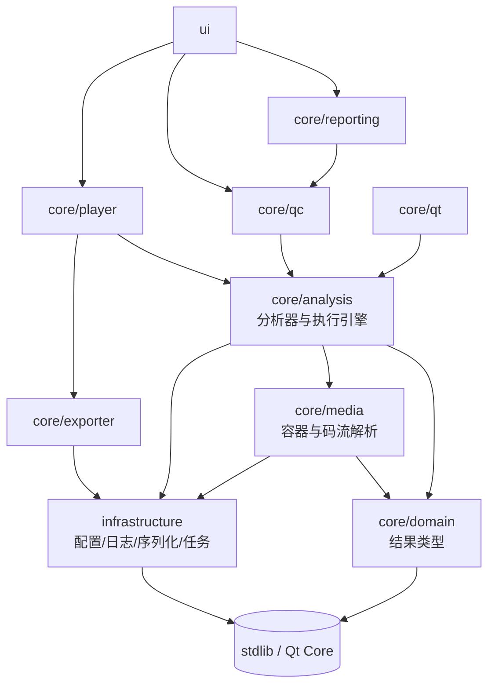

# 分层架构与依赖边界

本文说明 VideoEye 为什么按现在这套目录划分、各层之间允许怎么依赖，以及新增代码该放哪。

## 1. 一句话背景

项目早期只有一个 `utils/` 加一个 `core/`，两者各自包罗万象。结果是：想复用一份 MP4 解析，
要把日志 / 配置 / 报告导出一起拖进编译图；想让命令行跑一次分析，得先起一个 Qt 对象接信号。

现在的划分把"放得到处都是"的东西按**变更原因**归了堆，并且让每个堆在 CMake 里是一个真实的
targe —— 目录只是命名习惯，编译器不认识；能被机器检查的只有 `target_link_libraries` 那条边。

## 2. 目录与目标

| 目录 | CMake target | 职责 | 允许依赖 |
|------|--------------|------|----------|
| `core/domain/model/` | `VideoEyeDomain` | 纯结果类型与值对象 | standard library、Qt Core（历史包袱，见 §5） |
| `infrastructure/config`<br>`infrastructure/serialization`<br>`infrastructure/logging`<br>`infrastructure/concurrency` | `VideoEyeInfrastructure` | 配置、JSON、日志、后台任务调度 | standard library |
| `core/media/codec`<br>`core/media/container`<br>`core/media/probe`<br>`core/media/streaming` | `VideoEyeMedia` | 容器字节级解析、码流参数集解析、文件探测 | domain、infrastructure |
| `core/analysis/stream`<br>`core/analysis/orchestration`<br>`core/analysis/codec`<br>`core/analysis/container`<br>`core/analysis/quality`<br>`core/analysis/diagnostics` | `VideoEyeAnalysis` | 各分析器、执行引擎与编排 | domain、media、infrastructure、FFmpeg |
| `core/exporter/` | `VideoEyeExporter` | 转码 / remux 导出 | domain、infrastructure、FFmpeg |
| `core/player/` | `VideoEyePlayback` | 播放会话、解码、抽帧 | domain、analysis、exporter、infrastructure、FFmpeg |
| `core/qc/` | `VideoEyeQc` | 规则表、模板映射、批处理、对比 | domain、analysis、infrastructure |
| `core/reporting/` | `VideoEyeReporting` | 报告导出（JSON / CSV / HTML / PDF / TXT） | domain、qc、infrastructure |
| `core/ffmpeg/` | `VideoEyeFfmpegTools` | 原生 ffmpeg 命令行工作台 | infrastructure、Qt Core |
| `core/qt/` | `VideoEyeQtAdapters` | 把不带 Qt 的执行引擎接进信号 / 线程 | domain、analysis、Qt Core |
| `ui/` | （主程序） | 界面 | 以上全部 + Qt Widgets |

迁移期那个把十层全部 PUBLIC 出去的 `VideoEyeCore` INTERFACE 聚合层**已经删除** ——
它让每个调用方都能编译，代价是依赖关系重新变得不可见（正是因为它，`Playback → Exporter`
这条边一直没暴露）。现在主程序和每个测试都显式链自己需要的那几层。

FFmpeg 与 Qt6::Core/Gui 在 `analysis` / `playback` / `exporter` 上是 **PUBLIC** 而不是 PRIVATE：
这几层的公共头文件里有真正的 `libav*` 与 `QImage`，而静态库的 PRIVATE 依赖只传 link、不传
include 目录 —— 挂 PRIVATE 会让下游"能编译符号、找不到头文件"。

## 3. 依赖方向

箭头指向被依赖的一方，反向一律不允许：



三条硬规则：

1. **`domain` 不反向依赖任何人**。它不知道分析器、不知道 FFmpeg，也不吸 `core/analysis/*`。
   过去 `QcReport.h` 为了拿 `ColorHdrAnalysis` 去 include `ColorHdrAnalyzer.h`，等于让
   "报告""导出""UI"全都间接吃下一个分析器 —— 现在结果类型住在
   `core/domain/model/ColorHdrResult.h`，分析器也只是它的生产者之一。
2. **`analysis` 不依赖 Qt Widgets**。`AnalysisCoordinator` 曾经同时承担"跑分析"和
   "用 Qt 信号抛给 UI"，现在两者拆开：执行逻辑在 `AnalysisEngine`（普通回调，可在离线/批处理/单测里跑），
   `core/qt/QtAnalysisController` 只负责线程、generation 与信号。
3. **`media` 不依赖 FFmpeg**（除 video 解码那一层以外）。MP4 与 extradata 都是自研解析，
   这也是它们能被纯 stdlib 单元测试直接覆盖的原因。

## 4. 结果类型与执行者的分离

分析器产出结果，结果自己不带任何进行分析的能力：

```
core/domain/model/ColorHdrResult.h    ColorHdrAnalysis / ColorKeyValueRow
core/domain/model/BitrateGopResult.h  BitrateGopAnalysis / BitrateAnomaly / BitrateAnomalyType
core/domain/model/SceneChangeResult.h SceneChangeResult
core/domain/model/StreamStats.h       StreamStats
core/media/codec/ExtradataTypes.h     NalUnit / ObuUnit / ExtradataResult
core/analysis/AnalysisTypes.h         StreamDigest
core/analysis/AnalysisOptions.h       所有 *Options 与 AnalysisOptions
core/analysis/AnalysisResult.h        AnalysisResult
```

`AnalysisOptions` 单独成一个文件的意义：以前各分析器把 options 定义在自己的头文件里，
于是任何"只想传个参数"的模块都要 include 一整排分析器。现在反过来 —— 分析器 include
`AnalysisOptions.h` 取自己的选项，参数层一棵 import 树都往下也不传导到 FFmpeg。

下放结果类型时都在原分析器头文件里留了 `using model::Xxx;` 别名，既有调用方不用改命名空间。
但这些别名是**单向便利**：新代码请直接写 `model::Xxx`，别再让读结果的人绕道分析器头文件。

`core/reporting/` 里有两条互不相关的产品线，不要合并：

| 导出器 | 输入 | 用途 |
|--------|------|------|
| `QcReportExporter` | `QcExportBundle`（`QcRunResult` + profile） | QC 体检报告，`ExportReport()` 是只有裸 `QcReport` 时的便捷入口 |
| `StreamStatsExporter` | `model::StreamStats` | 播放器实时流统计快照（码率/帧率/GOP 曲线） |

两者曾经挤在同一个 `utils::ReportExporter` 里，导致 reporting 层为了导出一份流统计被迫
链接 FFmpeg（`StreamAnalyzer.h` 里有真正的 `libav*`）。拆开并把 `StreamStats` 下放到
domain 之后，reporting 已经是零 FFmpeg 依赖的一层。

## 5. 已知的历史包袱

- **命名空间没跟着目录走**。文件和 CMake target 已经分层了，但代码里仍叫
  `videoeye::analyzer::*`；`utils/` 目录拆进 `core/media/**` 与 `infrastructure/**` 之后，
  那些类型还在 `videoeye::utils` 命名空间里（`utils::BitReader`、`utils::JsonValue`…），
  全仓 200+ 处引用。改命名空间是纯机械替换，但每换一个就要动一批调用点，单独一轮做。
- `core/domain/model/` 里仍有 `QVector` / `QMap` / `QString`（如 `Mp4BoxInfo`、
  `ContainerStructureInfo`、`EbmlInfo`，共 6 个头文件约 70 处）。换成 STL 容器会牵动
  UI 表格与树控件的构造代码，和下面第 6 条一起留作独立一步。
- **UI 直接 include 分析器**。`AnalysisPanel` 一个人 include 了二十多个 `core/` 头文件，
  还没有收敛到 facade。这是下一轮的主题。

## 6. 怎么校验边界

`scripts/check_layering.py` 直接扫 `#include` 检查上面的方向是否被违反：

```
python scripts/check_layering.py
```

它只依赖 Python 标准库，不需要构建。规则写在脚本顶部的 `RULES` 里，允许三处迁移期例外
（`EXCEPTIONS`，都对应 §5 的历史包袱）。日常提交前跑一次比事后 review 更省事。

## 7. 新增代码放哪

| 你要加的东西 | 位置 |
|--------------|------|
| 一种新的分析维度 | `core/analysis/<类别>/`（容器 / 码流 / 质量 / 流媒体 / 诊断） |
| 新分析维度的开关 | `core/analysis/AnalysisOptions.h` 里的对应 options 结构 |
| 分析结果里的新字段 | 先在 `core/domain/model/` 起结果类型，再让 `AnalysisResult` 引用它 |
| 一种新的 QC 规则 | `QcRuleEngine::DefaultQcRules()` + 对应 `CheckRule()` 分支 |
| 新的报告格式 | `core/reporting/` |
| 界面 | `ui/`，通过 facade / controller 调一层之下的东西 |
