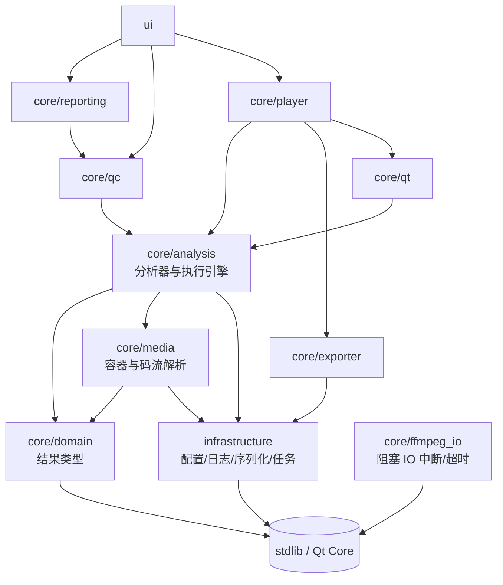

# 分层架构与依赖边界

本文说明 VideoEye 为什么按现在这套目录划分、各层之间允许怎么依赖，以及新增代码该放哪。

## 1. 一句话背景

项目早期只有一个 `utils/` 加一个 `core/`，两者各自包罗万象。结果是：想复用一份 MP4 解析，
要把日志 / 配置 / 报告导出一起拖进编译图；想让命令行跑一次分析，得先起一个 Qt 对象接信号。

现在的划分把"放得到处都是"的东西按**变更原因**归了堆，并且让每个堆在 CMake 里是一个真实的
targe —— 目录只是命名习惯，编译器不认识；能被机器检查的只有 `target_link_libraries` 那条边。

## 2. 目录与目标

| 目录 | CMake target | 职责 | 允许依赖 |
|------|--------------|------|----------|
| `core/domain/model/` | `VideoEyeDomain` | 纯结果类型与值对象 | standard library、Qt Core（历史包袱，见 §5） |
| `infrastructure/config`<br>`infrastructure/serialization`<br>`infrastructure/logging`<br>`infrastructure/concurrency` | `VideoEyeInfrastructure` | 配置、JSON、日志、后台任务调度 | standard library |
| `core/ffmpeg_io/` | `VideoEyeFfmpegIo` | FFmpeg 阻塞 IO 的中断与超时（**叶子模块**，分析/播放/导出共用） | FFmpeg |
| `core/media/codec`<br>`core/media/container`<br>`core/media/probe`<br>`core/media/streaming` | `VideoEyeMedia` | 容器字节级解析、码流参数集解析、文件探测 | domain、infrastructure |
| `core/analysis/stream`<br>`core/analysis/orchestration`<br>`core/analysis/codec`<br>`core/analysis/container`<br>`core/analysis/quality`<br>`core/analysis/diagnostics` | `VideoEyeAnalysis` | 各分析器、执行引擎与编排 | domain、media、infrastructure、ffmpeg_io、FFmpeg |
| `core/exporter/` | `VideoEyeExporter` | 转码 / remux 导出 | domain、infrastructure、ffmpeg_io、FFmpeg |
| `core/player/` | `VideoEyePlayback` | 播放会话、解码、抽帧 | domain、analysis、exporter、infrastructure、ffmpeg_io、qt、FFmpeg |
| `core/qc/` | `VideoEyeQc` | 规则表、模板映射、批处理、对比 | domain、analysis、infrastructure |
| `core/reporting/` | `VideoEyeReporting` | 报告导出（JSON / CSV / HTML / PDF / TXT） | domain、qc、infrastructure |
| `core/ffmpeg/` | `VideoEyeFfmpegTools` | 原生 ffmpeg 命令行工作台 | infrastructure、Qt Core |
| `core/qt/` | `VideoEyeQtAdapters` | 把不带 Qt 的执行引擎接进信号 / 线程；`QtWorkerOwner` 是所有自带 `QThread` 的后台 worker 的统一所有者 | domain、analysis、Qt Core |
| `ui/` | （主程序） | 界面 | 以上全部 + Qt Widgets |

迁移期那个把十层全部 PUBLIC 出去的 `VideoEyeCore` INTERFACE 聚合层**已经删除** ——
它让每个调用方都能编译，代价是依赖关系重新变得不可见（正是因为它，`Playback → Exporter`
这条边一直没暴露）。现在主程序和每个测试都显式链自己需要的那几层。

FFmpeg 与 Qt6::Core/Gui 在 `analysis` / `playback` / `exporter` 上是 **PUBLIC** 而不是 PRIVATE：
这几层的公共头文件里有真正的 `libav*` 与 `QImage`，而静态库的 PRIVATE 依赖只传 link、不传
include 目录 —— 挂 PRIVATE 会让下游"能编译符号、找不到头文件"。

## 3. 依赖方向

箭头指向被依赖的一方，反向一律不允许：



三条硬规则：

1. **`domain` 不反向依赖任何人**。它不知道分析器、不知道 FFmpeg，也不吸 `core/analysis/*`。
   过去 `QcReport.h` 为了拿 `ColorHdrAnalysis` 去 include `ColorHdrAnalyzer.h`，等于让
   "报告""导出""UI"全都间接吃下一个分析器 —— 现在结果类型住在
   `core/domain/model/ColorHdrResult.h`，分析器也只是它的生产者之一。
2. **`analysis` 不依赖 Qt Widgets**。编排层（老名字 `AnalysisCoordinator`，已删除）曾经
   同时承担"跑分析"和"用 Qt 信号抛给 UI"，现在两者拆开：执行逻辑在 `AnalysisEngine`
   （普通回调，可在离线/批处理/单测里跑），`core/qt/QtAnalysisController` 只负责线程、
   generation 与信号。
3. **`media` 不依赖 FFmpeg**（除 video 解码那一层以外）。MP4 与 extradata 都是自研解析，
   这也是它们能被纯 stdlib 单元测试直接覆盖的原因。

### 3.0 `core/ffmpeg_io`：为什么"取消能不能及时生效"要单独成一层

`AVIOInterruptCB`（让 `avformat_open_input` / `avformat_find_stream_info` / `av_read_frame`
从阻塞的网络 IO 里退出来）对每个碰 FFmpeg 的模块都是同一件事，但它的**归属**曾经是错的：
这套机制住在 `core/analysis/orchestration`，导出层（`VideoEyeExporter`）够不着，于是导出
链路只能在 `av_read_frame()` **返回之后**查取消标志 —— 输入是网络地址或管道时，那个返回
永远不会来，`Cancel()` 形同虚设，关窗还会卡在后台线程回收上。

所以它被下沉成一个**叶子模块**：只依赖 FFmpeg 公共头，不 include 任何 `core/` 层，
analysis / playback / exporter 都能依赖它。`scripts/check_layering.py` 里对应一条
"`core/ffmpeg_io` 不得 include 任何 core 层"的规则。

API 有两条硬约束（写在 `FfmpegInterrupt.h` 顶部）：回调必须在 `avformat_open_input`
**之前**装好（因此 `AVFormatContext` 得自己 `avformat_alloc_context`，不能传 `nullptr`
让 FFmpeg 自己分配），且 `AvInterruptState` 的生命周期必须覆盖整个 IO 过程 ——
它会被 `AVIOContext` / `URLContext` 各复制一份 `opaque` 指针，栈上的状态一返回就悬垂
（`MediaPlayer::open_interrupt_` 因此是成员而不是局部变量）。

### 3.1 后台线程的归属

后台任务分两类，归属不同，别混：

* **受管线程**（纯计算，不需要 Qt 信号）—— `task::TaskManager::Run()`，线程由
  TaskManager 持有并 join，`TaskId` + `CancelToken` + `IsCurrent()` 解决"过期结果回包"。
  容器结构分析、媒体信息解析走这条路。
* **自带 `QThread` 的 worker**（要发进度信号的 QObject）—— `qt::QtWorkerOwner`，
  线程与 worker 一起登记在所有者名下。这类线程**不可强制终止**（FFmpeg 可能卡在
  网络 IO 里，`quit()` 传不进去），所以取消超时后**绝不许丢弃句柄**：句柄转入待回收
  列表继续持有，析构时仍退不出来的才断开连接并脱管（宁可泄漏一个卡死的线程，
  也不能让 `QThread` 在运行时被销毁）。生命周期契约（Begin / End / Cancel）仍然登记在
  TaskManager 上，两边不冲突：TaskManager 管"任务"，QtWorkerOwner 管"线程"。

配套约定：取消令牌在**线程启动之前**注入 worker，worker 内部只读写、不重置取消状态，
否则"启动前立即取消"会被吃掉。

## 4. 结果类型与执行者的分离

分析器产出结果，结果自己不带任何进行分析的能力：

```
core/domain/model/ColorHdrResult.h    ColorHdrAnalysis / ColorKeyValueRow
core/domain/model/BitrateGopResult.h  BitrateGopAnalysis / BitrateAnomaly / BitrateAnomalyType
core/domain/model/SceneChangeResult.h SceneChangeResult
core/domain/model/StreamStats.h       StreamStats
core/domain/model/BitstreamUnits.h    NalUnit / ObuUnit（对外结果；media 层 utils:: 同名结构是解析器内部载体）
core/analysis/AnalysisTypes.h         StreamDigest
core/analysis/AnalysisOptions.h       所有 *Options 与 AnalysisOptions
core/analysis/AnalysisResult.h        AnalysisResult
```

`AnalysisOptions` 单独成一个文件的意义：以前各分析器把 options 定义在自己的头文件里，
于是任何"只想传个参数"的模块都要 include 一整排分析器。现在反过来 —— 分析器 include
`AnalysisOptions.h` 取自己的选项，参数层一棵 import 树都往下也不传导到 FFmpeg。

下放结果类型时都在原分析器头文件里留了 `using model::Xxx;` 别名，既有调用方不用改命名空间。
但这些别名是**单向便利**：新代码请直接写 `model::Xxx`，别再让读结果的人绕道分析器头文件。

`core/reporting/` 里有两条互不相关的产品线，不要合并：

| 导出器 | 输入 | 用途 |
|--------|------|------|
| `QcReportExporter` | `QcExportBundle`（`QcRunResult` + profile） | QC 体检报告，`ExportReport()` 是只有裸 `QcReport` 时的便捷入口 |
| `StreamStatsExporter` | `model::StreamStats` | 播放器实时流统计快照（码率/帧率/GOP 曲线） |

两者曾经挤在同一个 `utils::ReportExporter` 里，导致 reporting 层为了导出一份流统计被迫
链接 FFmpeg（`StreamAnalyzer.h` 里有真正的 `libav*`）。拆开并把 `StreamStats` 下放到
domain 之后，reporting 已经是零 FFmpeg 依赖的一层。

### 4.1 分析面板的页面组件

`AnalysisPanel` 曾经是一个 7700 行的"上帝面板"：建页面、存数据、刷表格、导 CSV、发扫描请求
全在一个类里。现在按"页面内聚"拆出独立组件，规则是：

- **组件本体就是 `QWidget`**，建好后交给 `AddPageWithScroll()` 直接变成外部 `QStackedWidget`
  的一页，不再额外包一层 tab widget（页面顺序 = `SetupUI()` 里的调用顺序，改顺序会动侧边栏）。
- **数据进来**：`SetResult()` / `ApplySampleTable()` / `SetQcReport()` / `SetScanActive()` …
- **意图出去**：`ScanRequested` / `CancelRequested` / `SeekRequested` / `StartTimecodeReady` …
  由 `AnalysisPanel` 转发（它才知道 `current_video_path_` 和全局 feature 表）。
- 组件内部**不许再碰 `AnalysisPanel` 的成员**：需要什么就从接缝拿。
- **扫描总控也归页面**：`DiagnosticsPage` 是唯一持有 `AnalysisFacade`、`QcReport`、
  扫描代数与时间轴状态的地方。面板只做两件跨页的事 —— 把 `ScanStarted` / `ProgressChanged` /
  `ScanFinished` / `ScanCancelled` 同步给共用同一次扫描的几页，以及把结果分发给它们。
  需要跨页改选项（如字幕阈值从规则表同步）时用 `SetBeforeScanHook()` 注入钩子，
  页面之间不互相 include。
- **一个页面可以是多个组件的组合**：外部 stack 的一页不一定等于一个组件。
  「码流分析」页就是 `StreamOverviewView`（顶部流概览，固定高度让曲线一直可见）+
  分隔条 + `FramePacketView`（底部视频帧/包/GOP/音频帧四张表，占剩余高度）拼成的，
  拼装与两者之间的数据桥接在 `SetupBitstreamTab()` 里。

| 组件 | 内容 |
|------|------|
| `ContainerStructurePage` | 结构树 + MP4/EBML 详情 + MP4 Sample Table + 结构导出 |
| `SceneChangePage` | 镜头边界检测：切换点表 + 强度柱状图 + CSV；`records()` 供码率页联动 |
| `VisualDefectPage` | 采样帧指标曲线（亮度 / 黑场比例 / 锐度 / 帧间差异）+ 缺陷表 + 证据缩略图 + CSV / 证据图导出 |
| `BitrateGopPage` | 滑动窗口码率曲线（I 帧 / 场景切换 / 峰值标记）+ GOP 表 + 异常 + 建议 |
| `AudioQcPage` | 响度 / 真峰值 / 削波 / 静音 / 声道相位 / metadata 一致性 |
| `ColorHdrPage` | primaries / transfer / matrix / range / HDR 元数据 |
| `SubtitleAuxPage` | 字幕 cue / SMPTE 时码 / 章节 / SCTE-35 / metadata |
| `EventTimelineView` | 「事件与时间轴」聚合页：异常事件 / 时间轴 / 同步分析三个子页 + 各自表格、曲线、CSV 导出 |
| `StreamOverviewView` | 「码流分析」页顶部：流概览 5 指标 + 码率 / 帧率 / GOP 三条趋势曲线 + 导出分析报告 |
| `FramePacketView` | 「码流分析」页底部：视频帧 / 包 / GOP 摘要 / 音频帧四张表 + 记录缓存 + 增量刷新 + CSV + 帧包按 PTS 互跳 |
| `MacroblockView` | 宏块分析：运动矢量表 + 矢量可视化 + 块大小 / 运动幅度分布 + CSV |
| `DiagnosticsPage` | 全文件扫描 + QC 规则引擎：问题清单（逐秒码率/帧率曲线 + 问题表）、规则与阈值表、时间轴与同步子页；报告重算、`ApplySceneLink()` 与导出都在这里 |

部分页面不持有全局状态但需要读写分析功能开关（`feature_enabled_`），用**注入钩子**代替反向
依赖面板：`SetFeatureHooks(is_enabled, set_enabled)`，视图只认自己内部的编号
（单开关的页如 `MacroblockView` / `StreamOverviewView` 用 0；多开关的如
`EventTimelineView` / `FramePacketView` 用 0/1/2），编号到 `AnalysisFeature` 的映射与
`AnalysisFeatureToggled` 转发由面板完成。**钩子注入时必须顺手把控件状态回写到界面**：
「启用分析」勾选框是组件构造函数里建的，那时钩子还不存在，只记钩子不回写就会出现
"界面显示已启用、面板里其实是关的"——数据被静默丢弃而界面毫无提示。

几个页面共用的无状态小工具（`SeriesBatch` 批量提交曲线、`TableBatch` 批量填表、
`SetTableItemText` 写单元格、`FormatMetricValue` / `FormatKb` / `AppendDecimated`）
在 `ui/analysis_panel/AnalysisPageSupport.h`；「码流分析」两个组件共用的记录结构
（`VideoFrameRecord` / `GopSummary` / `AudioFrameRecord` / `PacketRecord`）在
`ui/analysis_panel/StreamRecords.h`。

**共享状态归属**：拆页面时最容易卡住的就是"两份数据谁持有"。这一轮定下来的规则是
**谁产生谁持有，别人只读快照**：

- 场景切换记录由 `SceneChangePage` 持有（播放回调产生），「码率与 GOP」页要画标记 /
  关联关键帧时由面板在批量刷新里推一份 `SetSceneChanges(records)` 过去；
- 「关联场景切换」会改 facade 的 `result` 并让新产生的问题进入诊断报告：这一步**归
  `DiagnosticsPage`**（`ApplySceneLink()`：改 facade + `Evaluate()` + 重刷问题表 + 外发
  `QcReportChanged`），面板只负责收尾回调 `ShowSceneLinkSummary()`；
- 扫描结果 / QC 报告由 `DiagnosticsPage` 持有，其它页（码率 GOP、音频 QC、色彩 HDR、
  字幕辅助、流媒体包、参数集）一律用 `result()` / `qcReport()` / `hasResult()` 取只读快照；
- GOP 摘要由 `FramePacketView` 从解码帧 `pict_type` 推导产出（`GopSummary`），
  `StreamOverviewView` 用同一份数据填「最大GOP大小」并画「GOP 帧数分布」曲线。
  两边不互相持有指针：`FramePacketView::FlushPending()` 在 GOP 数据有变化时发一次
  `GopSummariesChanged()`，面板把它接到 `StreamOverviewView::SetGopSummaries()`。
  刻意放在刷新节拍上发（而不是每个 GOP 边界都发），避免大向量被反复拷贝。
- 页面之间**不互相 include、不互相持有指针**，跨页数据一律经面板接线，这样每个组件都能
  单独构造、单独测试（`EventTimelineView::SyncSampleReceived` → `DiagnosticsPage::OnSyncSample`
  也是同一套路，替代了早先的 `SetDiagnosticsPage()` 指针注入）。

## 5. 已知的历史包袱

- **命名空间没跟着目录走**。文件和 CMake target 已经分层了，但代码里仍叫
  `videoeye::analyzer::*`；`utils/` 目录拆进 `core/media/**` 与 `infrastructure/**` 之后，
  那些类型还在 `videoeye::utils` 命名空间里（`utils::BitReader`、`utils::JsonValue`…），
  全仓 200+ 处引用。改命名空间是纯机械替换，但每换一个就要动一批调用点，单独一轮做。
- `core/domain/model/` 里仍有 `QVector` / `QMap` / `QString` / `QMetaType`（如 `Mp4BoxInfo`、
  `ContainerStructureInfo`、`EbmlInfo`、`PacketInfo`、`TimelineEvent`，共 9 个头文件约 80 处）。
  换成 STL 容器会牵动 UI 表格与树控件的构造代码，留作独立一步（`VideoEyeDomain` 目前因此
  还 PUBLIC 链着 `Qt6::Core`）—— 要做就是把它们拆成 `VideoEyeDomain`（纯 stdlib）与
  `VideoEyeDomainQt`（Qt 容器适配）。
- **UI 侧仍有直接吃分析器的地方**。`AnalysisPanel` 已经只通过 `ui/AnalysisFacade` 拿
  编排 / QC / 时间轴三件事，facade 的公开头也只剩 `AnalysisOptions`、`AnalysisResult` 与
  domain model；但 `ColorHdrPage.cpp` 仍显式 include `ColorHdrAnalyzer.h`、
  `BitrateGopPage.cpp` 仍 include `BitrateGopAnalyzer.h`（用 `BuildColorRows` 与
  `BitrateAnomalyType`）。这两个函数/枚举下放到 domain 之后，UI 的 cpp 也能彻底不碰分析器。
- **`AnalysisPanel.cpp` 已从 2787 行降到 745 行**，拆出 12 个页面组件（见 4.1）。
  面板现在只剩协调职责：建页 → 注入 feature 钩子 → 播放期按开关过滤后转发数据 →
  扫描结束后分发结果。历史上它同时兼着"页面 + 数据仓库 + 表格控制器"三个角色，
  这一轮把最后两块也搬走了：「码流分析」（原 `bitstream_tab_` 合并的流/帧/包三页 →
  `StreamOverviewView` + `FramePacketView`）与「宏块分析」（原 `macroblock_tab_` →
  `MacroblockView`）。顺带清掉了随页面搬走后遗留的死代码：面板里那份从未被连接的
  `OnExportMp4Box()` 与匿名命名空间的 `PopulateMp4BoxTablesInContainer()`（真正的实现
  已在 `ContainerStructurePage.cpp` 里）、只写不读的 `bitstream_page_index_`、
  以及三段属于码率 GOP / 音频 QC 页的重复格式化辅助函数。

## 6. 怎么校验边界

`scripts/check_layering.py` 直接扫 `#include` 检查上面的方向是否被违反：

```
python scripts/check_layering.py
```

它只依赖 Python 标准库，不需要构建。规则写在脚本顶部的 `RULES` 里；`EXCEPTIONS` 现在
是**空的**（原来那两条迁移期例外——`AnalysisCoordinator` 别名层与 domain 复用 media 的
`NalUnit`/`ObuUnit`——都已各自解决），别再往里加新条目：那里每多一行就等于欠一张
"依赖方向没闭合"的条子。日常提交前跑一次比事后 review 更省事。

## 7. 新增代码放哪

| 你要加的东西 | 位置 |
|--------------|------|
| 一种新的分析维度 | `core/analysis/<类别>/`（容器 / 码流 / 质量 / 流媒体 / 诊断） |
| 新分析维度的开关 | `core/analysis/AnalysisOptions.h` 里的对应 options 结构 |
| 分析结果里的新字段 | 先在 `core/domain/model/` 起结果类型，再让 `AnalysisResult` 引用它 |
| 一种新的 QC 规则 | `QcRuleEngine::DefaultQcRules()` + 对应 `CheckRule()` 分支 |
| 新的报告格式 | `core/reporting/` |
| 界面 | `ui/`，通过 facade / controller 调一层之下的东西 |
