# 音频 QC（AudioQcAnalyzer）

> 目标：把"能听"变成"能交付"。覆盖广播 / 影视 / 流媒体交付最常用的音频体检项：
> 响度（LUFS）、真峰值（dBTP）、削波、静音、直流偏移、声道相位与 metadata 一致性。

## 1. 分层与数据流

```mermaid
flowchart LR
    UI[AnalysisPanel 音频 QC 页] -->|StartAnalysis| CO[AnalysisCoordinator]
    CO -->|demux + 音频解码| DEC[AVCodecContext]
    DEC -->|FLTP 或 swr 转换| FLT[float planar PCM]
    FLT -->|OnSamples| AQC[AudioQcAnalyzer]
    AQC -->|AudioQcResult| RES[AnalysisResult.audio_qc]
    RES --> ENG[QcRuleEngine 的 audio.* 规则]
    ENG -->|DiagnosticIssue| REP[诊断报告 / 音频 QC 页判定表]
```



设计要点：

- **与播放解耦、与码率扫描共用一次 demux**：音频 QC 挂在 `AnalysisCoordinator`（全文件扫描）里，
  与「码率与 GOP」「诊断与报告」三个页面共用同一次扫描，不额外读文件。
- **分析器不依赖 FFmpeg / Qt**：`AudioQcAnalyzer` 只吃 `float planar + 采样率 + 声道信息`，
  因此可以用合成 PCM 直接单测（见 [第 6 节](#6-测试验收)）。
- **格式归一化统一在调用方**：解码器输出就是 `AV_SAMPLE_FMT_FLTP` 时直接喂；
  否则用 `swr_convert` 转成 FLTP 再喂（不重采样，保持原始采样率）。

## 2. 新增文件

| 文件 | 作用 |
|------|------|
| `core/model/LoudnessPoint.h` | 响度/电平曲线上的点（100 ms 步进）：M / S / I + RMS + 峰值 + 真峰值 + 相关性 |
| `core/model/AudioQcResult.h/.cpp` | 结果模型：metadata、电平、响度、相关性、削波/静音事件、曲线 |
| `core/analyzer/AudioQcAnalyzer.h/.cpp` | 分析器（BS.1770 K 加权、4× 过采样真峰值、电平/相位统计） |
| `ui/analysis_panel/*` | 「音频 QC」页（第 10 个侧边栏页面） |
| `tests/unit/test_audio_qc_analyzer.cpp` | 分析器单测（合成 PCM） |
| `tests/unit/test_audio_qc_rules.cpp` | 规则判定单测（响度偏离 → warning / error） |

改动点：`AnalysisTask.h`（`AnalysisOptions.analyze_audio_qc` / `AnalysisResult.audio_qc`）、
`AnalysisCoordinator.cpp`（音频解码通路）、`QcModels.cpp`（11 条新规则）、
`QcRuleEngine.cpp`（`audio.*` 规则分支）。

## 3. 指标与算法

### 3.1 第一阶段（电平类，逐样本统计）

| 指标 | 实现 |
|------|------|
| 采样峰值 | 每声道 / 全局最大 \|x\|，[dBFS] |
| RMS | 整轨与 400 ms 窗口两种口径 |
| 削波 | \|x\| ≥ `clip_threshold`（默认 0.999 ≈ -0.009 dBFS，可捕获 16bit 满刻度 32767/32768）；同声道间隔 < 50 ms 归并为一段 |
| 静音段 | 窗口 RMS < `silence_threshold_dbfs`（默认 -60）且持续 ≥ `min_silence_seconds`（默认 0.5 s） |
| 声道能量 | 每声道 peak / RMS / DC，直接喂柱状图 |
| DC offset | 整轨样本均值（线性值与 dBFS 双口径） |
| 声道相关性 | 所有声道对的 Pearson 相关，取每块最差的一对；< -0.5 记为反相 |

### 3.2 第二阶段（BS.1770-4 响度）

- **K 加权**：两级 biquad（高频搁架 + RLB 高通），系数公式与 FFmpeg `ebur128.c` / libebur128 完全一致
  （`f0=1681.974450955533, G=3.999843853973347, Q=0.7071752369554196`；
  `f0=38.13547087602444, Q=0.5003270373238773`），按实际采样率用双线性变换生成。
  实测频响：1 kHz **+0.70 dB**、2 kHz +3.07 dB、高频 +4.04 dB、20 Hz -13.3 dB。
- **分块**：400 ms 块 + 75% 重叠（每 100 ms 出一个点），与标准一致。
- **Momentary (M)**：当前 400 ms 块。
- **Short-term (S)**：最近 30 个块（3 s 窗口）。
- **Integrated (I)**：绝对门限 -70 LUFS → 相对门限 -10 LU 的双门限均值（`Finish()` 里做精确两遍计算；
  曲线上的累计值是增量近似，避免 O(n²)）。
- **LRA**：EBU Tech 3341，对 S 序列做 -70 LUFS 绝对门限 + -20 LU 相对门限，取 P95 - P10。
- **声道加权**：前置 1.0 / 环绕 1.41（+1.5 dB）/ LFE 0（不参与响度）。角色由
  `AnalysisCoordinator` 把 `AVChannel` 翻译成 `AudioChannelRole` 后传入，分析器不认识 FFmpeg 枚举。
- **True Peak**：4× 过采样。插值核为 Hann 窗 sinc（截止 = 原始奈奎斯特），与 libebur128 同一设计；
  48 kHz 用 48 抽头，采样率每翻倍抽头翻倍（上限 192）。

### 3.3 性能与降级

- 真峰值只在"局部峰值 × Σ\|h\| > 当前真峰值"的块上计算（安全定界：`|y| ≤ Σ|h|·max|x|`），
  安静段落直接跳过；实测只有响度接近全片峰值的段落会走插值。
- 相关性对长窗口按步长抽稀到约 4096 个样本/声道对，把 O(N·C²) 压到可接受量级。
- 曲线点数超过 `max_loudness_points`（默认 20000）时按 2:1 对折抽稀，统计值仍基于全部样本。
- 关闭"真峰值(4×)"后 dBTP 回落为采样峰值 dBFS，并在 `notes` 里说明。

## 4. metadata 一致性检查

`AudioQcResult::metadata.inconsistencies` 会列出：

- 采样率缺失 / 低于 32 kHz
- 声道数缺失；多声道但容器未标注声道位置（`layout_confirmed=false`）
- 采样格式与位深均未标注
- 音频流时长 vs 容器时长偏差 > 0.5 s
- 音频流时长 vs 视频流时长偏差 > 0.5 s

## 5. UI 呈现（音频 QC 页）

| 子页 | 内容 |
|------|------|
| 响度与电平 | LUFS 曲线（M / S / 累计 I + 目标参考线）、电平曲线（RMS / 采样峰值 / 真峰值） |
| 静音与削波 | 静音段方波 + 削波点三角标记的时间轴、削波点表、静音段表（点击跳转 seek） |
| 声道与相位 | 声道能量柱状图（RMS / 峰值 dBFS）、相关性曲线、metadata 表 |
| 规则结果 | 11 条音频规则的通过 / 提示 / 警告 / 失败（阈值与「规则与阈值」页共用） |

顶部汇总给出：布局 / 采样率 / 时长 / 响度达标判定（绿-橙-红）、I/S/M/LRA、真峰值 / 峰值 / RMS / DC、
削波与静音统计、相关性、notes 与 metadata 不一致提示。

按钮：**开始分析**（与另外两页共用扫描）、**取消**、**导出响度 CSV**。

## 6. 测试验收

`tests/unit/test_audio_qc_analyzer.cpp`（16 例）与 `tests/unit/test_audio_qc_rules.cpp`（9 例）：

| 验收项 | 对应用例 |
|--------|----------|
| 全静音文件输出完整静音段 | `DigitalSilenceProducesFullSilenceRange`（1 段、覆盖全片、占比 ≈ 100%） |
| 人工削波样本输出 clipping | `ClippedSignalIsDetected` + `FullScaleTriggersTruePeakAndClipping` |
| 单声道 / 立体声 / 5.1 正确识别 | `ChannelLayoutsAreRecognized`（含 LFE 权重 0、环绕 1.41） |
| 响度目标偏离输出 warning / error | `LoudLoudnessTriggersHighTargetRule`（warning）、`QuietLoudnessTriggersLowTargetRule`、`FullScaleTriggersTruePeakAndClipping`（error） |
| 理论值对齐 | 满刻度 1 kHz 正弦 **-3.00 LUFS**（-0.691 + 10log10(1/2) + 0.70）；-20 dBFS 单声道 **-23.0 LUFS**；同信号铺两声道 +3.01 dB |
| 静音/DC/反相/时长不一致 | `SilenceGapInTheMiddleIsDetected`、`DcOffsetIsMeasured`、`OutOfPhaseStereoIsDetected`、`DurationMismatchIsReported` |
| 无数据不误报 | `NoFalsePositiveWithoutAudioAnalysis` |

沙箱内快速跑分析器单测：

```bash
bash scripts/run-audioqc-tests.sh     # 直接 cl 编译 + 运行（gtest 用 .workbuddy/tmp/gtest_main_shim.cpp 补 main）
```

CMake 方式：`cmake -DBUILD_TESTING=ON` 后 `ctest -R "AudioQc"`。

## 7. 已知边界

- 只分析**第一条**音频流；多语种/多轨场景后续再扩展。
- 音频参数（采样率/声道数）中途变化时丢弃变化后的帧，并在 `notes` 里提示。
- 短期响度与 LRA 需要至少 3 s 素材，短片会在 `notes` 里注明。
- 真峰值采用与 libebur128 相同的插值核，属于"标准推荐实现"，与硬件表的差异通常在 0.1 dB 内。
