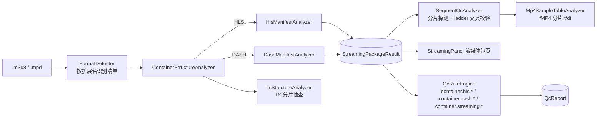

# HLS / DASH 流媒体包检测（manifest + segment + 多码率 ladder）

> 目标：OTT 分发场景不能只体检单个媒体文件，还要体检「清单 + 分片 + 码率阶梯」。
> 本功能在完全离线的本地包上完成这一层检查，并把问题接入既有的 QC 规则体系。

## 1. 定位与数据流



设计要点：

- **清单不走 FFmpeg**。`avformat_open_input()` 会把 `.m3u8` / `.mpd` 当播放列表去发网络
  请求，离线分析时既不可控（卡在网络超时），也拿不到有意义的时长/码率序列。
  因此 `FormatDetector` 先用扩展名把清单分流到自研解析器，
  `AnalysisCoordinator::Run()` 在任何 IO 之前就分流到 `RunStreamingManifest()`。
- **清单不是容器但复用容器页**。`ContainerFormat` 新增 `HLS` / `DASH` 两个枚举，
  结果挂在 `ContainerStructureResult::streaming_package` 上，
  「文件结构」页与「流媒体包」页消费同一份结果，只是视图不同。
- **纯 C++ 可单测**。`HlsManifestAnalyzer` / `DashManifestAnalyzer` / `SegmentQcAnalyzer`
  的头文件和实现都不依赖 Qt 与 FFmpeg（fMP4 探测复用自研的 `utils::IsobmffParser`），
  单测直接喂文本或合成结构。只有 TS 分片的逐包解析依赖 `TsStructureAnalyzer`（Qt 侧）。

## 2. 核心模型（core/model/）

| 文件 | 内容 |
| --- | --- |
| `core/model/SegmentInfo.h` | `SegmentInfo`：一个分片的 URI / 序号 / 时长 / 起点 / 容器形态 / 落盘情况 / fMP4 的 tfdt |
| `core/model/StreamPackageInfo.h` | `HlsVariantInfo` / `HlsRenditionInfo` / `MediaPlaylistInfo` / `DashPeriodInfo` / `DashAdaptationSetInfo` / `DashRepresentationInfo` / `StreamingLadderEntry` / `StreamingPackageResult` / `StreamingIssue` |

`StreamingLadderEntry` 是把 HLS 的 variant 与 DASH 的 representation 投影出来的统一视图，
UI 与 ladder 级校验只认这个结构，不必区分协议。

问题码（`StreamingIssueCode`）同时用作 QC 规则 id，与 `Mp4IssueCode` 的做法一致：

- `container.hls.*` —— HLS 专用
- `container.dash.*` —— DASH 专用
- `container.streaming.*` —— 两者通用（分片落盘 / 容器解析）

## 3. 解析器能力

### 3.1 HLS（core/analyzer/HlsManifestAnalyzer）

| 标签 | 处理 |
| --- | --- |
| `EXT-X-STREAM-INF` | 解析 BANDWIDTH / AVERAGE-BANDWIDTH / RESOLUTION / CODECS / FRAME-RATE / AUDIO / VIDEO / SUBTITLES |
| `EXT-X-MEDIA` | 备选音轨 / 字幕轨，按 GROUP-ID 与 variant 配对 |
| `EXT-X-TARGETDURATION` | 目标分片时长 |
| `EXTINF` | 分片时长，同时累加出清单侧的起点时间轴 |
| `EXT-X-MAP` | fMP4/CMAF 初始化段 |
| `EXT-X-DISCONTINUITY` / `EXT-X-DISCONTINUITY-SEQUENCE` | 不连续标记的位置与序号 |
| `EXT-X-KEY` | 加密标签（METHOD / URI / KEYFORMAT），只登记不解密 |
| `EXT-X-PART` / `EXT-X-PART-INF` / `EXT-X-PRELOAD-HINT` | LL-HLS 部分分片 |
| `EXT-X-BYTERANGE` / `EXT-X-GAP` / `EXT-X-ENDLIST` / `EXT-X-PLAYLIST-TYPE` | 记录到对应字段 |

master playlist 会递归加载子播放列表（本地文件），受 `max_variants` / `max_playlists` /
`max_segments_per_playlist` 保护。

### 3.2 DASH（core/analyzer/DashManifestAnalyzer）

极简 XML 标签扫描器（不引入第三方 XML 库），识别：

`MPD`（type / mediaPresentationDuration / maxSegmentDuration）→ `Period` →
`AdaptationSet` → `Representation`（bandwidth / width / height / codecs / frameRate）→
`SegmentTemplate`（timescale / duration / startNumber / presentationTimeOffset /
initialization / media）→ `SegmentTimeline`（`<S t= d= r=/>`），
以及 `SegmentBase` / `SegmentList` + `SegmentURL` / `BaseURL`。

`<S>` 会展开成 `SegmentInfo`；`media` 模板支持 `$Number$` / `$Number%05d$` /
`$Bandwidth$` / `$RepresentationID$` / `$Time$`。
`Representation` 未自带 `SegmentTemplate` 时继承 `AdaptationSet` 级的那一份。

### 3.3 分片级与 ladder 级校验（core/analyzer/SegmentQcAnalyzer）

| 检查 | 问题码 | 级别 |
| --- | --- | --- |
| 分片时长超过 EXT-X-TARGETDURATION | `container.hls.segment_duration_over_target` | Warning |
| 分片时长抖动（末片不计） | `container.hls.segment_duration_jitter` | Warning |
| discontinuity 未闭合 / 未与序号配对 / 音视频位置不一致 | `container.hls.discontinuity_unpaired` | Error / Warning |
| fMP4 缺 EXT-X-MAP | `container.hls.missing_init_section` | Warning |
| 加密标签（登记） | `container.hls.encryption_key` | Info |
| LL-HLS 部分分片（登记） | `container.hls.partial_segment` | Info |
| SegmentTimeline 时间缺口 | `container.dash.segment_timeline_gap` | **Error** |
| SegmentTimeline 时间重叠 | `container.dash.segment_timeline_overlap` | Error |
| 完全没有分片定位信息 | `container.dash.missing_segment_info` | Error |
| ladder 分辨率缺失或与码率顺序矛盾 | `container.{hls,dash}.variant_resolution_mismatch` | Warning |
| ladder 混用不同视频编码 | `container.{hls,dash}.variant_codec_mismatch` | Warning |
| 多码率关键帧（分片起点）不对齐 | `container.{hls,dash}.variant_keyframe_misalign` | Warning |
| 实测峰值段码率高于声明带宽 | `container.{hls,dash}.{variant,representation}_bandwidth_mismatch` | Warning |
| 音视频分片数量/时长对不上 | `container.{hls,dash}.av_segment_count_mismatch` | Warning |
| 分片文件不存在 | `container.streaming.segment_missing_file` | Warning |
| 分片容器解析失败 | `container.streaming.segment_container_invalid` | Error |

关键帧对齐的口径：CMAF/fMP4 分片必须以 IDR 开头，因此**分片的 tfdt 起点即关键帧时间**。
`SegmentQcAnalyzer::ProbeSegments()` 先解析初始化段拿 timescale，再逐个分片读首个
`moof` 的 `tfdt`；TS 分片没有 tfdt，退化为清单声明的累计时长（ABR 惯例即段首为 IDR）。

## 4. UI 呈现（ui/streaming_panel/StreamingPanel）

「流媒体包」页（由 `AnalysisPanel::SetupStreamingPackageTab()` 注册，
侧边栏条目由 `content_stack_` 的 `pageTitle` 自动生成）：

- **顶部摘要**：清单类型 / 点播或直播 / 码率层数 / 分片数 / 各级问题数
- **左侧 manifest 结构树**：HLS 的 variant / rendition / media playlist / segment，
  DASH 的 Period / AdaptationSet / Representation / Segment
- **右上码率阶梯表**：分辨率 / 码率 / 编码 / 容器 / 分片数 / 平均与最长分片时长 / 初始化段 / 关键帧数
- **右下分片时间轴对齐表**：行是分片序号，列是各码率层，单元格是该层的分片起点；
  与参考层偏差超过 50 ms 的单元格标红
- **问题表**：按严重度排序并着色（与 QC 页同一套配色）

工具栏支持「重新扫描」「复制 JSON」「导出 JSON」。

## 5. 接入点一览

| 位置 | 改动 |
| --- | --- |
| `core/model/ContainerStructureInfo.h` | `ContainerFormat` 增加 `HLS` / `DASH`；结果增加 `streaming_package` |
| `core/analyzer/FormatDetector.cpp` | `DetectByExtension` 识别 `.m3u8` / `.mpd`，补 `FormatName` / `FormatTitle` |
| `core/analyzer/ContainerStructureAnalyzer.cpp` | 新增 `AnalyzeStreamingManifest` / `BuildStreamingTree` / `ProbeTsSegments` |
| `core/analyzer/AnalysisTask.h` | `AnalysisOptions::analyze_streaming_package` + `AnalysisResult::streaming_package` |
| `core/analyzer/AnalysisCoordinator.cpp` | `Run()` 前置分流 + `RunStreamingManifest()` |
| `core/model/QcModels.cpp` | 新增 22 条规则（HLS 12 / DASH 8 / streaming 2），id 与问题码同名 |
| `core/analyzer/QcRuleEngine.cpp` | 新增 `container.hls.` / `container.dash.` / `container.streaming.` 三个前缀分支 |
| `ui/main_window/MainWindow.cpp` | 打开对话框补「流媒体清单 (*.m3u8 *.mpd)」 |

## 6. 测试

- `tests/unit/test_streaming_package.cpp`：解析与校验（合法 VOD 包不误报、
  时长越界 Warning、关键帧不对齐 Warning、SegmentTimeline 缺口/重叠 Error、
  EXT-X-MAP / KEY / PART 解析、分片缺失告警）
- `tests/unit/test_streaming_qc_rules.cpp`：规则引擎把 finding 转成 `DiagnosticIssue`
  （级别、标题、阈值、可关闭、未分析时不产出）

```bash
cmake --preset win-test-release
ctest --preset win-test-release
```

## 7. 当前限制与后续

- **第一阶段只支持本地包**。清单里的 `http(s)://` URI 只登记（`StreamingPackageResult::remote`），
  不下载。第二阶段计划用 Qt Network 增加超时 / 重试 / Range 请求，并只采样头尾与前 N 个分片。
- **TS 分片只抽查前 3 个**（`ContainerStructureAnalyzer::ProbeTsSegments`）。
  同一批分片由同一次切片产出，抽查足以暴露结构性问题。
- **关键帧对齐对 TS 是"声明值对齐"**。要判断 TS 段首是否真的是 IDR，需要逐包解析，
  目前由 `TsStructureAnalyzer` 验证结构完整性，未提取首帧类型。
- **CMAF 兼容性**目前覆盖到"fMP4 分片必须有初始化段 + tfdt 起点对齐"这一层，
  未校验 `styp` brand、轨道切换（`trun` 的 `sample_depends_on`）等更细的 CMAF 约束。
