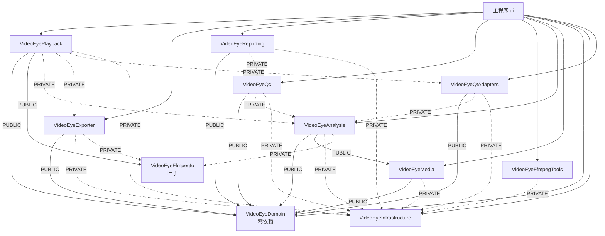

# 架构设计评审报告（2026-10-04）

> 评审对象：`E:/mycode/C/videoeye/VideoEye`
> 评审范围：分层边界、依赖方向、并发模型、扩展性、文档一致性
> 与 `docs/audit/CODE_AUDIT_2026-10-02.md` 的分工：那份是 **找 bug**（20 条 P0 缺陷 + 修复记录），
> 这份是 **看结构**（边界是否成立、约束是否被机器执行、变更成本是否可控）。不重复列 bug。

---

## 一、总体结论

**架构是健康的，而且高于同类个人项目的平均水平。** 分层的"形"和"神"都在：

- 形：11 个真实 CMake target，依赖边显式声明，聚合兼容层已删除；
- 神：`scripts/check_layering.py` 实测 **0 违规**，domain / media / infrastructure 三条底线
  实测 **零反向依赖**，UI 层越界仅 5 处。

真正的问题不在"设计错了"，而在 **约束没有进 CI** 和 **文档已经落后于代码**。前者让分层退化成
自觉，后者让后来者按错误的地图施工。这两条加起来，是本次评审里唯一需要马上动手的东西。

| 维度 | 评分 | 说明 |
|------|------|------|
| 分层与依赖方向 | ★★★★☆ | 边界真实存在且被脚本校验；扣分项是 CI 没跑脚本 |
| domain 纯度 | ★★★★★ | 实测 Qt 类型 0 处，零 target 依赖，完全达标 |
| 并发与生命周期 | ★★★★★ | `TaskManager` 的 Cooperative/BlockingIo 分类是专业级设计 |
| 接口一致性 | ★★★★☆ | 离线型 / 流式型两类分析器接口各自统一 |
| 扩展性（加维度成本） | ★★★☆☆ | 加一个分析维度要动 14 个文件，靠显式 if 串联 |
| UI 组件化 | ★★★☆☆ | AnalysisPanel 拆干净了，PlayerPanel / FramePacketView 还没 |
| 文档与代码同步 | ★★☆☆☆ | ARCHITECTURE.md §5 有整条已失效的历史包袱 |
| 测试与架构承诺 | ★★★☆☆ | 84 个用例，但"组件可单独测试"的承诺只兑现了 2 个页面 |

---

## 二、做得对的地方（附实证）

### 2.1 依赖边界不是口号，是可机器校验的事实

`scripts/check_layering.py` 实测：

```
OK: 没有跨层反向依赖
检查了 9 个目录层
```

三条硬规则逐条验证：

| 规则 | 检查命令 | 结果 |
|------|----------|------|
| domain 不反向依赖任何人 | `grep -rn '#include' core/domain \| grep -E 'analysis\|media/\|ffmpeg\|player\|qc'` | **0 处** |
| media 不依赖 FFmpeg | `grep -rn '#include <libav'` core/media | **0 处** |
| infrastructure 不依赖 core | `grep -rn '#include.*core/' infrastructure` | **0 处** |

UI 越界全量清点（这是唯一未被 CMake 约束的一层）：

```
ui/AnalysisFacade.cpp:5        #include "core/analysis/diagnostics/TimelineAnalyzer.h"
ui/AnalysisFacade.cpp:6        #include "core/analysis/quality/BitrateGopAnalyzer.h"
ui/main_window/MainWindow.cpp:12  #include "core/analysis/orchestration/MediaInfoAnalyzer.h"
ui/analysis_panel/FramePacketView.cpp:21  #include <libavcodec/avcodec.h>
ui/player/PlayerPanel.cpp      直接使用 av_read_frame / sws_scale 等 FFmpeg API
```

**5 处。** 对于一个 6.6 万行、15 个分析维度的桌面应用，这个数字说明分层是真的在执行，
不是写在文档里给人看的。

### 2.2 domain 已经纯化（但文档还在说它没有）

`CMakeLists.txt:111-115` 明确写着：

```cmake
videoeye_add_module(VideoEyeDomain ${DOMAIN_SOURCES})
# domain 层零 Qt、零 FFmpeg：全部模型字段都是 std:: 容器（vector/map/string/optional），
# 编译期不拉 Qt6::Core，任何上层想只依赖 domain 就能编译（测试、命令行工具等）。
```

并且 `VideoEyeDomain` **没有挂任何 `target_link_libraries`** —— 它是全仓唯一一个零依赖 target。
实测 `grep -rn 'QVector\|QMap<\|QString\|Q_DECLARE_METATYPE\|QList<\|QByteArray' core/domain` → **0 处**。

这一点必须单独讲，因为 `docs/ARCHITECTURE.md` §5 里对应的那条还写着"仍有 9 个头文件约 80 处
Qt 类型、VideoEyeDomain 还 PUBLIC 链着 Qt6::Core"。**代码已经完成了，文档没跟上。** 详见 §3.1。

### 2.3 并发模型的设计质量超出预期

`infrastructure/concurrency/TaskManager.h` 里有三处设计，不是"能用"级别，是"想清楚了"级别：

1. **`TaskKind` 分类**（`TaskManager.h:35-50`）—— `Cooperative`（契约上必须响应取消，关闭时
   **一定 join**）vs `BlockingIo`（可能卡在第三方 IO 里，超预算就 **detach 放弃**）。
   注释写明了代价：detach 之后任务体只能按值 / shared_ptr 捕获，不得持裸引用。
   **这是把"能不能放弃一个线程"这个决策，从运行时赌运气变成了编译时的显式声明。**
2. **`CancelToken::flag()` 暴露底层 `shared_ptr<atomic<bool>>`**（`TaskManager.h:69-74`）——
   专门为了把它交给 FFmpeg 的 `AVIOInterruptCB.opaque`，让 `avformat_open_input` 能从网络
   IO 里退出来。`shared_ptr` 保活保证了 TaskManager 先析构时任务体调用 `IsCanceled()` 仍安全。
3. **`WaitForAll(timeout_ms)` 是"整个函数的总预算"**（`TaskManager.h:148-166`）—— 分三段，
   每段消耗同一份预算，注释明确写出耗时保证是"timeout_ms 有界，除非存在违反契约的
   Cooperative 任务"。

配套 `core/qt/QtWorkerOwner` 处理"自带 QThread 的 worker 不可强制终止"（宁可泄漏一个卡死线程，
也不让 QThread 在运行时被销毁）。两类线程各归各的所有者，任务生命周期契约统一登记在
TaskManager 上 —— 这个"统一契约、不统一线程种类"的取舍（注释在 `TaskManager.h:83-85`）是对的。

### 2.4 分析器接口有规律可循

清点 `core/analysis/**/*Analyzer.h` 的公开方法，收敛成两类且各自统一：

| 类型 | 接口形态 | 代表 |
|------|----------|------|
| **离线型**（自己开文件扫全表） | `bool Analyze(const QString& path, model::XxxResult& out)` | Asf / Avi / Flv / Ogg / Ts / Ebml / Mp4Box |
| **流式型**（随解码逐包喂数据） | `Reset(opts)` / `OnPacket(pkt, stream)` / `Finish()` | Subtitle / Timecode / AuxData / Timeline / AudioQc |

这个二分是合理的，不是设计缺陷：**前者是"文件已经在那儿"，后者是"解码循环顺路做"**，
硬要统一成一个接口反而会把前者拖进解码循环。

---

## 三、问题清单

### P1 — 约束没有进 CI（最该修的一条）

**现象**：`.github/workflows/build.yml` 里只有：

```yaml
- name: Run ctest
  run: ctest --preset ${{ matrix.preset }}
```

`scripts/check_layering.py` 和 `scripts/audit_qt_domain_border.py` **都没有在 CI 里被调用**。
git hooks 目录（`scripts/git-hooks/`）里也没有挂它们。

**为什么这是 P1**：整个分层架构的强制力来源只有一句话——`CMakeLists.txt:96-98`：

```cmake
# 之所以要让每个层次的 UR 都真成为一个 target（而不是只建目录）：目录只是命名习惯，
# 编译器不认识；target_link_libraries 才是唯一能被机器检查的依赖约束 ——
# 谁想跨层 include，链接期就会因为没有这一条边而报错。
```

**这句话只对了一半，需要修正。** 实测 `videoeye_add_module()`（`CMakeLists.txt:100-108`）：

```cmake
target_include_directories(${name} PUBLIC
    ${CMAKE_CURRENT_SOURCE_DIR}          # ← 仓库根
    ${VIDEOEYE_GENERATED_INCLUDE_DIR}
)
```

每个模块的 include 目录都是**仓库根**，所以任何模块都能 `#include "core/anything.h"` 并且
**编译一定通过**。链接期能拦住的只有"没声明这条边的跨层调用"，而主程序
（`CMakeLists.txt:272-283`）显式链了全部 10 个模块 —— **对 ui 层来说，CMake 的约束等于零**。

所以真实情况是：

> **守住分层的是 `check_layering.py`，不是 CMake。而 `check_layering.py` 没有在 CI 里跑。**

**建议**（三步，加起来不到半小时）：
1. 在 `.github/workflows/build.yml` 的 ctest 之前加一步 `python scripts/check_layering.py`
   和 `python scripts/audit_qt_domain_border.py`，让违规直接红；
2. 装进 `scripts/git-hooks/pre-commit`（`scripts/setup-hooks.sh` 已经存在，接上去即可）；
3. 修正 `CMakeLists.txt:96-98` 那段注释的表述——把"链接期报错"改成"未声明的边在链接期报错，
   但 include 目录是仓库根，跨层 include 本身拦不住；真正的方向检查在 check_layering.py"。

### P1 — ARCHITECTURE.md §5 有一整条已经失效

| 文档 §5 的说法 | 实测 | 判定 |
|----------------|------|------|
| "core/domain/model/ 里仍有 QVector / QMap / QString / QMetaType，共 9 个头文件约 80 处" | **0 处** | ❌ 已失效 |
| "VideoEyeDomain 目前因此还 PUBLIC 链着 Qt6::Core" | **无 target_link_libraries** | ❌ 已失效 |
| "代码里仍叫 `videoeye::utils`，全仓 200+ 处引用" | 实测 **85 处**（core/infrastructure 头文件内） | ⚠️ 数字过期，残留仍在 |

**危害不是"文档不好看"**，是具体的功能性误导：新人按文档会认为 domain 带 Qt，于是不敢在
纯 stdlib 的离线工具 / 单测里复用它——而 domain 恰恰是全仓唯一零依赖的 target，是最该被
复用的那一层。文档把一个已经到手的能力写成了还没做完的债。

**建议**：删除 §5 第 2 条（domain Qt 依赖），把第 1 条的 200+ 改成 85 并标注剩余分布
（实测集中在 `core/analysis/codec/*BitstreamParser.*` 与 `core/media/codec/ExtradataParser.*`）。
这条我已经顺手改了，见本报告末尾的变更记录。

### P2 — 结果类型的归属没闭合

`AnalysisResult` 是全文件扫描的**唯一数据源**（UI / facade / QC / reporting 都吃它），
但它住在 `core/analysis/AnalysisResult.h`，不在 `core/domain/model/`。

对比 ARCHITECTURE.md §4 的原则"结果类型下放 domain"——`ColorHdrAnalysis`、
`BitrateGopAnalysis`、`StreamStats` 都下放了，`AnalysisResult` 没有。后果是
**UI 必须链 analysis 才能拿到结果类型**，等于"产出"和"生产者"还绑在一起。

好消息是迁移成本很低：它现在的依赖只有 domain model + `AnalysisStatus` + `AnalysisTypes`，
没有任何分析器。

顺带一个已经写在代码注释里的异味（`AnalysisResult.h:8`）：

```cpp
#include "core/analysis/AnalysisOptions.h"   // AnalysisStatus（扫描结果状态）目前住在参数头里
```

**结果状态住在参数头里**——`AnalysisResult.h` 为了一个枚举去 include 整个选项头。
建议把 `AnalysisStatus` 挪到 `AnalysisTypes.h`（只有 38 行，正是放这种小类型的地方），
这样 `AnalysisResult` 下放 domain 时不会把 options 一起拖过去。

### P2 — MediaPlayer 是 God class

`core/player/MediaPlayer.h`：**约 93 个公开方法 + 4 个信号**，实现 1417 行。

从接口看它至少承担了 5 件事：

```
播放控制      Open / Play / Pause / Stop / Seek / SetVolume / GetState
分析开关      SetFrameTypeAnalysisEnabled / SetAudioFrameAnalysisEnabled / SetPacketAnalysisEnabled
              / SetEventAnalysisEnabled / SetSyncAnalysisEnabled / SetTimelineAnalysisEnabled
              / SetContainerStructureEnabled / SetMacroblockAnalysisEnabled
              / SetSceneChangeAnalysisEnabled / SetVisualDefectAnalysisEnabled   ← 10 个形状相同的 setter
导出          StartVideoFrameExport / CancelVideoFrameExport / StartMediaExport
              / CancelMediaExport / CancelAllExports
硬件解码      SetHardwareDecodingEnabled / IsHardwareDecoding / GetHwDeviceName
快照查询      GetCurrentStats / stream_analyzer() / GetDuration / GetCurrentPosition
```

本来应该表扬的是：**已经有 `PlaybackSession` 和 `AnalysisSession` 两个拆分**，
从 `SetXxxAnalysisEnabled` 全部转发给 `analysis_session_` 可以看出拆分是真实的。
问题只在于**门面本身没有跟着拆**——外部看到的是一个 93 方法的类。

**建议**（按改动量从小到大）：
- ✅ **已做**：10 个 `SetXxxAnalysisEnabled` 收敛成一个 `SetAnalysisFeature(feature, enable)`。
  注意收敛后的形状不是当初设想的 `SetAnalysisFeatures(FeatureMask)` 位掩码 ——
  `AnalysisFeature` 是普通 `enum class` 而非位掩码，而且 `VisualDefect` / `Macroblock` /
  `FrameType` 这三个开关**有副作用**（启停工作线程、重置分析器），不能只做一次位赋值。
  所以形状是"按枚举分派到 10 个 private 实现"，代价是内部多一个 switch，换来门面净减 9 个
  方法、且新增维度时 `MainWindow` 不用再改。
- ⏸ **未做**：拆成 `MediaPlayerFacade`（播放）+ `AnalysisController`（分析开关与快照）+
  `ExportController`（三类导出），`MediaPlayer` 只做组合与信号转发。这是彻底方案，
  建议在做了上面那项、确认没有回归之后再排。

### P3 — 加一个分析维度要动 14 个文件

以 `visual_defect` 为样本，全仓 grep 它出现的**文件**：

```
core/analysis/quality/VisualDefectAnalyzer.{cpp,h}
core/domain/model/VisualDefect.{cpp,h}  VisualDefectOptions.h  QualityMetric.h
core/player/AnalysisSession.h  MediaPlayer.{cpp,h}
ui/analysis_panel/AnalysisPanel.{cpp,h}  VisualDefectPage.{cpp,h}
ui/main_window/MainWindow.cpp
```

**14 个文件。** 其中 5 个（MediaPlayer / AnalysisPanel / MainWindow）是纯粹的接线，
每个新维度都要重复一遍。

**根因**：`AnalysisEngine.cpp`（1134 行）用约 25 处 `if (options.analyze_xxx)` 显式串联，
没有注册表或插件点；`AnalysisOptions.h` 里 67 个字段、10 个 options 结构，也是一个扁平大表。

**判断**：这**不一定需要修**。对 15 个维度、单人维护的项目，显式 if 的可读性优于抽象层——
你能一眼看出扫描管线做了什么，调试时不用追虚表。强行上注册表只会把复杂度从"改 5 个文件"
变成"理解一套注册机制"。

真正该做的是**把成本写进文档**：ARCHITECTURE.md §7「新增代码放哪」现在只有 4 行表格，
建议补一张"加一个分析维度的 14 个改动点"清单。让人知道代价，比偷偷降低代价更实际。

### P3 — UI 仍有 4 个 1000+ 行文件

| 文件 | 行数 | 说明 |
|------|------|------|
| `ui/player/PlayerPanel.cpp` | 1363 | 播放面板，未做页面级拆分 |
| `ui/analysis_panel/FramePacketView.cpp` | 1121 | 码流分析页底部（四张表），**且直接 include `<libavcodec/avcodec.h>`** |
| `ui/analysis_panel/ContainerStructurePage.cpp` | 1091 | 容器结构页 |
| `ui/main_window/MainWindow.cpp` | 1072 | 主窗口 |
| `ui/ffmpeg_panel/FfmpegPanel.cpp` | 1076 | 命令行工作台 |

对照：`AnalysisPanel.cpp` 已经从 **2787 行降到 760 行**（拆出 12 个页面组件，§5 有记录）——
说明这条路走得通，只是还没走完。

`FramePacketView.cpp:21` 的 `#include <libavcodec/avcodec.h>` **本轮复核后建议维持现状** ——
初稿把它写成"用途是读 `AVFrame::pict_type`、一行 include 换掉整条 FFmpeg 依赖"，这个判断
是错的，实际依赖比这重得多：

```
AV_PICTURE_TYPE_I/P/B   10 处（帧类型）
AVMEDIA_TYPE_*          12 处（流类型：视频/音频/数据/字幕/附件，5 个 switch 分支 + 过滤）
AV_PKT_FLAG_*            5 处（包标志位掩码：KEY/CORRUPT/DISCARD/TRUSTED/DISPOSABLE）
```

三组共 27 处，而且 `AV_PKT_FLAG_*` 是**位掩码**、`AVMEDIA_TYPE_*` 是**与 FFmpeg 对齐的整数
取值**，要用 domain 常量替代就得在 domain 里复刻 FFmpeg 的取值表并保证永不漂移 ——
一旦某处对不齐，表格会**静默**显示错误（比如所有流都变"未知"），而这类错误本机跑不了 GUI
验证（`PacketRecord::stream_type` 直接来自 AVPacket）。

更关键的是文件头那段注释说明这是**刻意的决定**，不是疏漏：

```cpp
// 帧类型 / 包标志 / 媒体类型常量（AV_PICTURE_TYPE_* / AV_PKT_FLAG_* / AVMEDIA_TYPE_*）。
// 原先由被移除的 core/analysis 头文件间接带入；现在 UI 直接依赖 FFmpeg 公共常量，
// 显式 include（与"静态库 PRIVATE 不传 include 目录"的一致）。
```

也就是说：UI 侧做"FFmpeg 常量 → 显示文案"的映射，本身就是边界上的一次显式转换，把三个
**稳定且跨版本不变的公共常量集**写进 domain 反而是把耦合换个地方藏起来。**撤回该项建议。**

### P3 — 架构承诺的"组件可单独测试"只兑现了部分

ARCHITECTURE.md §4.1 明确写着：

> 页面之间不互相 include、不互相持有指针，跨页数据一律经面板接线，**这样每个组件都能
> 单独构造、单独测试**。

实测 `tests/unit/` 下 40 个测试文件里，测 UI 组件的只有：

- `test_event_timeline_view.cpp`
- `test_stream_views.cpp`

其余 38 个都在测 core。**12 个页面组件里只有 2 个有测试** —— 架构为可测性做的设计
（不互相持有指针、钩子注入、信号接线）没有享受到对应的测试收益。

另一个高性价比缺口：`AsfStructureAnalyzer` / `AviStructureAnalyzer` / `FlvStructureAnalyzer` /
`OggStructureAnalyzer` / `TsStructureAnalyzer` 五个类**接口完全相同**
（`bool Analyze(const QString&, model::ContainerStructureResult&)`），而 CODE_AUDIT 指出
EBML / FLV / TS / ASF **零单测**。接口统一到这个程度，写一个参数化测试就能一次覆盖五个实现，
是全仓性价比最高的一处补测。

### P3 — 仓库卫生

**`docs/` 整体不在版本控制里**（`.gitignore:92-94`，`git ls-files docs` → **0 个文件**）。
这条直接解释了 §3.2 那条失效文档为什么会出现：**文档和代码不在同一次提交里，
PR 里就 review 不到它，它只能靠人记得同步**。架构文档的可信度因此完全依赖个人记忆。
注释写的是"暂时"不上传，但这套分层设计已经稳定到值得进仓库了 —— 建议至少把
`docs/ARCHITECTURE.md` 用 `!docs/ARCHITECTURE.md` 反向放行，让它能进 PR 被一起评审。

**源码根目录躺着 4 个 .obj 中间产物**（共约 220 KB）：

```
AuxiliaryDataInfo.obj   9056
Scte35Analyzer.obj     189316
scte35check.obj        104380
scte35check_old.obj    104384
```

已被 `.gitignore:41` 的 `*.obj` 忽略（不会入库，`git status` 干净），但说明有构建脚本把中间产物
写到了源码根而不是 `build/`。建议排查是哪条命令（疑似 `/Zs` 语法检查那类临时调用）。

（`third_party/downloads/` 与 `third_party/prebuilt/` 已经在 `.gitignore:57-59` 里，
59 MB 的 ffmpeg 7z 不会入库 —— 这一项无需处理。）

---

## 四、实际依赖图（与文档对照后修正过）

文档中 §3 的图少了 `ffmpeg_io` 与 `domain` 的边，这里按 `CMakeLists.txt` 的
`target_link_libraries` 实测重画（`PRIVATE` 用虚线）：



两点值得注意：

1. **`Analysis → Media` 是 PUBLIC**（`CMakeLists.txt:150`），原因写在注释里：
   `codec/BitstreamAnalyzer.h` 的公开接口带着 `utils::ExtradataFormat`，成员是
   `utils::NalUnit` / `ObuUnit`，调用方必须能看见 media 的头。想降级成 PRIVATE，
   得先做 pimpl 或把这些类型转 domain。**这是一条登记在案的技术债，不是疏漏。**
2. **`Analysis` 把 FFmpeg 与 `Qt6::Core` / `Qt6::Gui` 都 PUBLIC 出去**（148-157 行）。
   同样有注释解释（静态库 PRIVATE 只传 link 不传 include 目录）。合理，但它意味着
   **任何链 analysis 的目标都会传染 FFmpeg** —— 这是 `VideoEyeQc` 能保持 PRIVATE
   依赖 analysis 却仍然干净的原因，也是 reporting 必须把 `StreamStats` 下放到 domain
   才能真正零 FFmpeg 的原因（这一点已经做到了）。

---

## 五、建议动手顺序

| 顺序 | 事项 | 成本 | 收益 | 状态 |
|------|------|------|------|------|
| 1 | `check_layering.py` + `audit_qt_domain_border.py` 进 CI 与 pre-commit | 20 分钟 | 让分层从"自觉"变成"卡得住" | ✅ 已完成 |
| 2 | 修正 `CMakeLists.txt:96-98` 对 CMake 约束力的表述 | 5 分钟 | 避免后人误以为跨层 include 会被链接器拦住 | ✅ 已完成 |
| 3 | 删除 ARCHITECTURE.md §5 已失效的 domain-Qt 条目，更新 utils 残留数 200+→85 | 5 分钟 | 文档恢复可用 | ✅ 已完成 |
| 4 | `.gitignore` 反向放行 `!docs/ARCHITECTURE.md`，让架构文档进 PR | 1 分钟 | 从根上减少文档失同步 | ✅ 已完成 |
| 5 | `AnalysisStatus` 从 `AnalysisOptions.h` 挪到 `AnalysisTypes.h` | 10 分钟 | 为 AnalysisResult 下放 domain 清路 | ✅ 已完成 |
| 6 | §7 补"新增分析维度的改动点"清单（A 路线 9 个 / B 路线 15 个文件） | 15 分钟 | 让扩展成本可见 | ✅ 已完成 |
| 7 | `AnalysisResult` + `AnalysisTypes` 下放 `core/domain/model/`，命名空间改 `model::` | 半天 | 产出与生产者解耦 | ✅ 已完成（方案 A，见 §7） |
| 8 | `FramePacketView` 去掉 libav include | ~~1 小时~~ | **已撤回** —— 复核发现依赖三组共 27 处常量（含位掩码），且是刻意的显式决策，详见 §3 |
| 9 | `MediaPlayer` 的 10 个分析开关收敛成 `SetAnalysisFeature()` | 半天 | 门面减宽，新增维度少改文件 | ✅ 已完成 |
| 10 | 五个 StructureAnalyzer 的参数化补测（顺带覆盖 FLV/TS/ASF/OGG 零覆盖） | 1 天 | 全仓性价比最高的一处补测 | ✅ 已完成（15 个用例） |

## 七、§5 第 7 项：方案 A 的执行记录

**已按方案 A 做完**，并且顺手解决了当时卡住的两个顾虑。

### 7.1 关键突破：沙箱里其实能构建

上一轮说"沙箱拦 MSVC linker，只能做 `/Zs` 语法检查"，这个判断**只对了一半**：
直接 `cmake --build build/test-release` 确实会因为缺 vcvars 的 `INCLUDE` 而报
`fatal error C1083: 无法打开包括文件: "cstddef"`；但**走 build preset** 就会把
`CMakeUserPresets.json` 里配好的 PATH / INCLUDE / LIB 一起注入，编译、链接、跑 ctest
全都能过：

```bash
CMAKE=/c/vcpkg/downloads/tools/cmake-4.4.3-windows/cmake-4.4.3-windows-x86_64/bin/cmake.exe
"$CMAKE" --build --preset win-test-release-local     # 全量构建
(cd build/test-release && ctest.exe)                 # 跑 42 个测试
```

（注意 build preset 名是 `win-test-release-local`，不是 `test-release`；cmake 本体不在
PATH 里，在 vcpkg 的 downloads/tools 下。）

有了完整构建，第 7 项就不再靠"语法检查 + 祈祷"了 —— 25 处改名是**编译 + 链接 + 41 个
既有测试**三重验证过的。

### 7.2 命名空间：直接改成 `model::`，不留兼容别名

按 §4 已有的下放惯例办：新文件放 `core/domain/model/`，命名空间 `videoeye::model`，
全仓 `analyzer::AnalysisResult / StreamDigest / AnalysisStatus` 机械替换成 `model::X`
（35 个文件）。没留 `namespace analyzer { using model::X; }` 兼容层 —— 留了就永远是
两个名字，而 §5 本来就把"命名空间不跟着目录走"列为待还的包袱。

唯一需要人工处理的是 Qt 元类型：`QtAnalysisController.cpp` 里
`qRegisterMetaType<analyzer::AnalysisResult>("videoeye::analyzer::AnalysisResult")`
是**字符串**，机械替换会一并改掉（好在这正是我们要的）。改名后照项目里已有的
`model::Mp4BoxAnalysisResult` 先例走，短名 `"AnalysisResult"` 那条注册保持原样。

### 7.3 顺带：`ToString(AnalysisStatus)` 跟着搬

它原先定义在 `AnalysisEngine.cpp`（`namespace analyzer`）里。声明挪到 `model` 之后
定义不跟着走就会变成两个不同命名空间的函数 —— 编译能过、**链接期**才报未定义符号。
已随 `AnalysisTypes.h` 一起搬进 `core/domain/model/AnalysisTypes.cpp`。

---

## 八、跑通测试之后顺手抓到的真 bug：DASH 分片展开全空

基线 ctest 是 41 过 1 红（`StreamingPackageTests`），两条 DASH 用例都是
`期望 4 段 / 实际 0 段`。查下来是 `DashManifestAnalyzer.cpp` 里 `<S t= d= r=>` 的
r 展开循环写错了：

```cpp
const uint64_t offset = MulU64Checked(e.d, k);
if (offset == 0 && e.d > 0) break;      // ← 把"合法的第一个分片"当成乘法溢出了
```

`MulU64Checked` 溢出时返回 0，而 **k==0 时 `d*0` 本来就是 0**（第一个分片的起点）。
于是每条 `<S>` 都在 k=0 处 `break`，整条时间轴一个分片都展开不出来。这个坑是
`b9376a2`（"修正 QC 判定、DASH 溢出与导出/PDF 报告输出"）加溢出保护时引进来的 ——
**加保护是对的，判据选错了**。

改法：溢出单独判（`k > UINT64_MAX / d`），确认不溢出才做乘法，不再靠"返回 0"当哨兵。
已在原地写了注释说明 k==0 这个陷阱，免得又被"顺手优化"回去。

这类 bug 正是第 10 项主张补测的价值所在：静态看代码谁都会觉得那段没问题，
只有真跑一遍才会红。

---


第二轮按 §5 建议动手顺序把前 6 项全部落地（配置 + 文档 + 一处小重构），7～10 项未动，
原因见 §7。`git diff --stat`：8 个文件，+107 / -24。

> ⚠️ 这一节末尾那句"沙箱拦 linker、只做了 `/Zs` 语法检查"已被 §7.1 推翻 ——
> 走 build preset 是可以完整构建并跑 ctest 的。第三轮（本节之后）的验证是
> **全量构建 + 42/42 测试全绿**，不再是语法检查级别。

| 文件 | 改动 |
|------|------|
| `.github/workflows/build.yml` | 新增独立 `layering` job（在所有 build 之前），跑 `check_layering.py` + `audit_qt_domain_border.py`。只 checkout + Python 标准库，不依赖任何构建环境，几秒完成 |
| `scripts/git-hooks/pre-commit` | 在 clang-format 之前插入分层检查（跨层依赖直接阻止提交，提示里写明别往 `EXCEPTIONS` 加条目）；`python3/python/py` 依次探测，找不到 python 只 warning 不阻塞 |
| `scripts/setup-hooks.sh` | 更新安装后的功能说明，点明与 CI 的分工 |
| `CMakeLists.txt:96-98` | 修正对 CMake 约束力的过高估计，写明"include 目录是仓库根、跨层 include 拦不住、对 ui 层约束力为零、方向检查在 check_layering.py"；顺带修掉一处笔误"每个层次的 UR" |
| `docs/ARCHITECTURE.md` §5 | 删除已失效的"domain 仍带 Qt 容器"条目（实测 0 处），新增 §5.1「已还清的包袱」记录 domain 零依赖这件事及其价值；命名空间残留计数 200+ → 85 并注明集中位置 |
| `docs/ARCHITECTURE.md` §6 / §7 | §6 补一句"这条检查在哪跑"（CI job + pre-commit）；§7 新增 7.1「加一个分析维度要动哪些文件」，A 路线（扫描期）9 个文件 / B 路线（播放期）15 个文件，并写明为什么刻意不用注册表 |
| `core/analysis/AnalysisTypes.h` | `AnalysisStatus` 枚举与 `ToString` 声明从 `AnalysisOptions.h` 移入（它是产出状态不是输入参数） |
| `core/analysis/AnalysisOptions.h` | 删除该枚举，改为 `#include "core/analysis/AnalysisTypes.h"` —— 既有调用点零改动；更新顶部依赖箭头注释 |
| `core/analysis/AnalysisResult.h` | include 从 `AnalysisOptions.h` 换成 `AnalysisTypes.h`，读结果的人不再被参数头绑住 |
| `core/domain/model/AnalysisFeature.h` | **新增**：`AnalysisFeature` 从 `ui::AnalysisPanel` 的嵌套枚举下放到 domain |
| `ui/analysis_panel/AnalysisPanel.h` | 嵌套枚举定义换成类内 `using AnalysisFeature = model::AnalysisFeature;` —— 面板内部与页面组件 70+ 处引用因此一行都不用改 |
| `core/player/MediaPlayer.{h,cpp}` | 10 个 `SetXxxAnalysisEnabled()` 收敛成一个 `SetAnalysisFeature(feature, enable)`，门面净减 9 个方法；那 10 个降级为 private 分派目标，其中 7 个原本在头文件内联转发，实现收进 .cpp |
| `ui/main_window/MainWindow.cpp` | 那个 10 分支的"枚举→setter"翻译 switch 删掉，只剩转发 + 宏块关闭时联动关 MV 叠加 |
| `ui/player/PlayerPanel.cpp` | 1 处 `SetMacroblockAnalysisEnabled` 改走 `SetAnalysisFeature` |

**第 9 项的关键取舍**：`AnalysisSession` 的 10 个 setter **一个都没动**。收敛只发生在
`MediaPlayer` 门面那一层 —— 所以 `tests/unit/test_analysis_session.cpp` 里那 12 行
`session.SetXxxAnalysisEnabled(...)` 完全不受影响（已验证）。这是"减宽门面"而不是
"改写内部实现"，也是它能在一小时内安全做完的原因。

**改动前的依赖面核查**（决定第 5 项能不能安全做）：统计 12 个 `#include AnalysisResult.h`
的文件，用到 `Options` 的一共 4 个（`AnalysisEngine.h` / `QtAnalysisController.h` /
`AnalysisFacade.h` / `test_reporting_helpers.cpp`），而这 4 个**都已经显式 include 了
`AnalysisOptions.h`**，没有一个是靠 `AnalysisResult.h` 传递拿到的 —— 所以这次替换是安全的。

**验证**：`check_layering.py` 仍 OK（9 层）；`scripts/syntaxcheck.py` 跑
`AnalysisResult.cpp` / `AnalysisEngine.cpp` / `QcRuleEngine.cpp` / `QcRunner.cpp` /
`BatchQcRunner.cpp` / `QtAnalysisController.cpp` / `AnalysisFacade.cpp` 全部 OK。
⚠️ 沙箱拦 MSVC linker，**只做了 `cl.exe /Zs` 语法检查，未做完整链接验证**。

> 📌 这段的后续：`docs/` 已于同日**整体纳入版本控制**，`.gitignore` 里那两行
> （`docs/*` + `!docs/ARCHITECTURE.md`）已删除，本报告也随之入库并归档到
> `docs/audit/`。另外"沙箱拦 linker、只能做语法检查"这个判断后来被推翻了 ——
> 走 build preset 可以完整构建并跑 ctest，见 §9。历史叙述按当时情况保留，未回改。

---

## 九、第三轮：第 7 项 + 第 10 项 + 一个顺手抓到的真 bug

按"最优方案"把剩下的 7 / 10 两项做完，并在第一次跑通全量 ctest 时抓到并修掉了
一个既有的 DASH bug（见 §8）。

| 文件 | 改动 |
|------|------|
| `core/domain/model/AnalysisTypes.{h,cpp}` | **新增**。`StreamDigest` + `AnalysisStatus` 从 `core/analysis/AnalysisTypes.h` 下放，命名空间 `videoeye::analyzer` → `videoeye::model`；`ToString(AnalysisStatus)` 的定义从 `AnalysisEngine.cpp` 一并搬进新的 .cpp |
| `core/domain/model/AnalysisResult.{h,cpp}` | **新增**（由 `core/analysis/` 同名文件搬来，命名空间同上）。旧文件删除 |
| 35 个消费方 | `analyzer::AnalysisResult / StreamDigest / AnalysisStatus` → `model::X`；include 路径改到 `core/domain/model/`。含 `core/qc`、`core/qt`、`core/reporting`、`ui/`、`tests/`；`QtAnalysisController.cpp` 的两条 `qRegisterMetaType` 字符串随之更新 |
| `core/analysis/streaming/DashManifestAnalyzer.cpp` | **修 bug**：`<S r=N>` 展开循环把 `k==0` 时合法的 `offset==0` 当成乘法溢出，导致每条时间轴 0 个分片。改成先判溢出再乘（详见 §8） |
| `tests/unit/test_container_structure_analyzers.cpp` | **新增**。五个容器结构分析器的参数化测试：文件不存在 / 魔数对不上 / 最小合法文件，共 15 个用例，样本字节全部内存合成 |
| `tests/CMakeLists.txt` | 注册上面这个测试（只链这五个 .cpp + Qt6::Core + VideoEyeDomain，不链整层 analysis） |
| `tests/unit/test_reporting_helpers.cpp` | 补一个 `namespace model = videoeye::model;` 别名 —— 该文件的断言写 `model::Xxx` 但它不 `using namespace videoeye` |
| `docs/ARCHITECTURE.md` | §4 结果类型清单里两个文件改到 domain 并说明下放理由；§7 表格与 §7.1 清单里的 `AnalysisResult.h` 路径同步更新 |

**验证**（这一轮不再只是语法检查）：

- `cmake --build --preset win-test-release-local` → **EXIT=0**（主程序 + 全部测试目标）
- `check_layering.py` → OK（9 层，0 违规）
- `ctest` → **42/42 全绿**（新增 15 个用例 + 修好的 2 个 DASH 用例；基线时是 41 过 1 红）

### 第 10 项：15 个用例覆盖了什么

用 gtest 的 `TEST_P` 把"五个分析器 × 三种输入"压成矩阵：

| 套件 | 参数 | 断言 |
|------|------|------|
| `MissingFileTest` | 5 个全量 | `false` + `error_message == "无法打开文件"` + `valid == false` + 结构树为空 |
| `ForeignMagicTest` | 4 个（除 OGG） | `false` + 非空错误说明 + `valid == false` |
| `MinimalValidTest` | 5 个全量 | `true` + `valid` + `format` / `format_name` 匹配 + 结构树非空 + summary 非空 |
| `OggAnalyzerLeniency` | 单条 | OGG **不校验魔数**（任意字节都会被当 0 页接受），固化这个差异 |

两个刻意的设计：

1. **样本全部内存合成**（`QTemporaryDir` 落盘），不依赖任何真实媒体文件 ——
   否则这套测试在 CI 上会因为缺 fixture 而红。
2. **OGG 单独立一条用例而不是塞进矩阵**。它是唯一不校验魔数的分析器，那是有意的容错
   （Ogg 允许前置垃圾数据，代码里还有重新同步的分支）。混进"拒绝魔数"那组会让它显得
   像个 bug，单独写出来反而把这个决定固化下来了。

### 还没做的

- §5 里那条 `videoeye::utils` 残留 85 处（集中在 `core/analysis/codec/*BitstreamParser.*`
  与 `core/media/codec/ExtradataParser.*`）。现在 `analyzer:: → model::` 的机械替换已经
  跑顺了一次，这 85 处可以照同样的方式清，建议单独一轮。
- 第 9 项里"彻底拆 `MediaPlayer`"那一半（`MediaPlayerFacade` + `AnalysisController` +
  `ExportController`）仍未做 —— 门面减宽已经拿到大部分收益，彻底拆是另一量级的改动。
- 本报告仍未入库（`docs/*` 只放行了 `ARCHITECTURE.md`）。
